<!---
Ejemplos

<video class="stretch" controls><source src="http://clips.vorwaerts-gmbh.de/big_buck_bunny.mp4" type="video/mp4"></video>
<iframe width="560" height="315" src="https://www.youtube.com/embed/3RBq-WlL4cU" frameborder="0" allowfullscreen></iframe>

slide: data-background="#ff0000" 
element: class="fragment" data-fragment-index="1"
-->
## Entornos de desarrollo
---

<small> 2017-18 - IES Luis Vélez de Guevara - Écija - Spain </small>

## Elaboración de diagramas de clases

## Índice
--- 
### Introducción
### UML: Lenguaje de modelado unificado
### UML: Software para crear diagramas
### UML: Tipos de diagramas
### UML: Diagramas de clases

<!--- Note: Nota a pie de página. -->

## Introducción

En esta Unidad aprenderemos a:

- Identificar los conceptos básicos de la programación orientada a objetos.
- Instalar el módulo del entorno integrado de desarrollo que permite la utilización de diagramas de clases.
- Identificar las herramientas para la elaboración de diagramas de clases.
- Interpretar el significado de diagramas de clases.
- Trazar diagramas de clases a partir de las especificaciones de las mismas.
- Generar código a partir de un diagrama de clases.
- Generar un diagrama de clases mediante ingeniería inversa.

## UML: Lenguaje de modelado unificado

- Es un lenguaje visual de propósito general para representar **modelos**.
- Pretende proporcionar una forma estándar de representar el diseño de un sistema.
- Dispone de numerosos tipos de diagramas.
- Cada tipo de diagrama muestra un aspecto diferente del modelo.

## UML: Software para crear diagramas

- Enterprise Architect
- Visual Paradigm
- Microsoft Visio
- Dia, ArgoUML, Umbrello
- Plugins para Netbeans (**easyUML**, plantUML)
- Plugins para Eclipse (...)
- Plugins para IntellJ Idea (...)
- [Lista exhaustiva](https://en.wikipedia.org/wiki/List_of_Unified_Modeling_Language_tools)

## UML: Tipos de diagramas

- **diagramas de estructura** (aspecto estático)
- **diagramas de comportamiento** (aspecto dinámico)

## UML: Diagramas de clases

### Clases

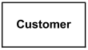

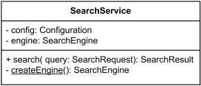

### Objetos

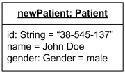

### Interfaces

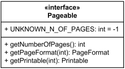

### Relaciones

- Asociación
    - Agregación
    - Composición
- Dependencia
- Generalización
- Realización

#### Asociación

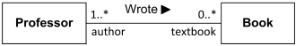

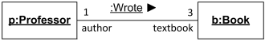

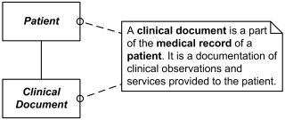

#### Agregación

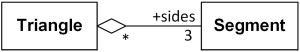

#### Composición

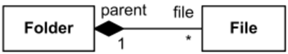

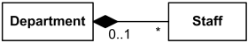

#### Dependencia

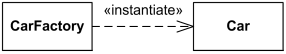

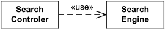

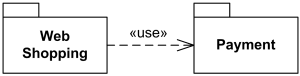

#### Generalización (herencia)

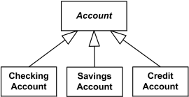

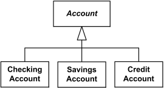

#### Realización (implementación de interfaces)

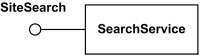

### Ejemplos

- [Karts](https://raw.githubusercontent.com/iesvelez-daw/karts/master/img/kartsUML.png)
- [Videojuego](https://raw.githubusercontent.com/iesvelez-daw/videojuego/master/img/videojuegoUML.png)
- [Colegio](https://raw.githubusercontent.com/iesvelez-daw/colegio/master/img/colegioUML.png)
- [Zoo](https://raw.githubusercontent.com/iesvelez-daw/zoo/master/img/zooUML.png)

