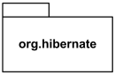
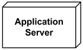
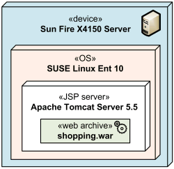
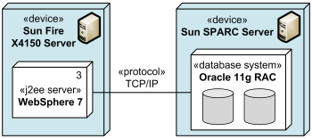
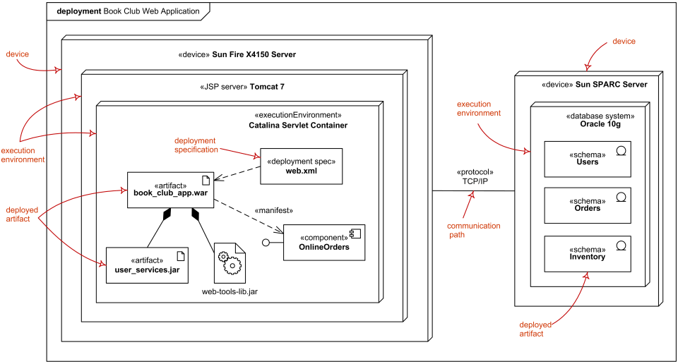

<!---
Ejemplos

<video class="stretch" controls><source src="http://clips.vorwaerts-gmbh.de/big_buck_bunny.mp4" type="video/mp4"></video>
<iframe width="560" height="315" src="https://www.youtube.com/embed/3RBq-WlL4cU" frameborder="0" allowfullscreen></iframe>

slide: data-background="#ff0000" 
element: class="fragment" data-fragment-index="1"
-->
## Entornos de desarrollo
---

<small> IES Luis Vélez de Guevara - Spain </small>

## Elaboración de diagramas de clases

## Índice
--- 
- ### Introducción
- ### UML
- ### **Diagramas de clases**
- ### Diagramas de paquetes
- ### Diagramas de componentes
- ### Diagramas de despliegue
- ### Software
<!--- Note: Nota a pie de página. -->

## Introducción

En esta Unidad aprenderemos a:

- Identificar las herramientas para la elaboración de diagramas de clases.
- Interpretar el significado de diagramas de clases.
- Generar código a partir de un diagrama de clases.
- Generar un diagrama de clases mediante ingeniería inversa.

## UML

**Lenguaje de modelado unificado**

- Es un lenguaje visual de propósito general para representar **modelos**.
- Pretende proporcionar una forma estándar de representar el diseño de un sistema.
- Dispone de numerosos tipos de diagramas.
- Cada tipo de diagrama muestra un aspecto diferente del modelo.
- Actualmente disponible la versión 2.5. Existen algunas diferencias respecto a las versiones 1.x.

###  UML: Tipos de diagramas (I)

- **diagramas de estructura** (aspecto estático)
- **diagramas de comportamiento** (aspecto dinámico)

### UML: Tipos de diagramas (II)

### UML: Diagramas de estructura

Los más utilizados son:

- **Diagramas de clases**
- Diagramas de paquetes
- Diagramas de componentes
- Diagramas de implementación

## Diagramas de clases

### Elementos

- **Clases**
- **Relaciones**
  - Nombre
  - Multiplicidad
  - Roles

### Clases

### Interfaces

- **`<<estereotipo>>`**: los estereotipos permiten tomar elementos propios del UML y convertirlos en otros que se ajusten a las necesidades. Se usan cuando no existe tal elemento en UML. 

### Objetos

- No aparecen en los diagramas de clases.
- Aparecen en los diagramas de objetos y en diagramas de comportamiento.

### Relaciones

TIPOS DE RELACIONES

- **Asociación**
    - **Agregación**
    - **Composición**
- **Dependencia**
- **Generalización / Especialización**
- **Realización**

#### Asociación (I)

- Es el vínculo (conector) entre 2 clases que necesitan comunicarse entre sí.
- Se puede representar mediante una línea con una flecha que indica la dirección de navegación.
- En el caso de que la flecha esté en ambos lados, la asociación tiene asociación bidireccional. 

#### Asociación (II)

- Es posible agregar **notas**: hoja con la esquina superior derecha doblada.

#### Agregación

- La clase "padre" es contenedor no exclusivo de la clase "hija".
- **Si eliminamos la instancia de la clase "padre" NO se elimina la instancia de la clase "hija"**.

Note: Aquí los términos "padre" e "hija" no tienen ninguna relación con la herencia.

#### Composición

- La clase "padre" es contenedor exclusivo de la clase "hija".
- **Si eliminamos la instancia de la clase "padre" SÍ se elimina la instancia de la clase "hija"**.

Note: Aquí los términos "padre" e "hija" no tienen ninguna relación con la herencia.

#### Dependencia

#### Generalización / Especialización

**HERENCIA**

#### Realización

**IMPLEMENTACIÓN DE INTERFACES**

#### Resumen de relaciones

### Ejemplos

#### Karts

#### Videojuego

#### Colegio

#### Zoo

## Diagramas de paquetes

- Un **paquete** es **un espacio de nombres** que se usa **para agrupar elementos** que están relacionados semánticamente.

- **Si se elimina un paquete, también los elementos** que pertenecen al paquete. 

- **Un paquete a su vez se puede empaquetar**, por lo que cualquier paquete también podría ser miembro de otros paquetes.

### Ejemplo

## Diagramas de componentes

- Un **componente** es una clase que representa una **parte modular de un sistema**.

### Interfaces

- Un componente tiene su comportamiento definido en términos de las **interfaces proporcionadas** y las **interfaces requeridas** (potencialmente expuestas a través de **puertos**).

### Ejemplo

## Diagramas de despliegue (deployment)

- Muestra la arquitectura del sistema como despliegue (distribución) de **artefactos de software** a destinos de despliegue (**nodos**).

### Artefactos

- Los **artefactos** representan **elementos concretos en el mundo físico** que son el resultado de un proceso de desarrollo. 

- Ejemplos de artefactos son **archivos ejecutables**, **bibliotecas**, **archivos**, **esquemas de base de datos**, **archivos de configuración**, etc.

### Ejemplos de artefactos

También pueden usarse iconos personalizados.

### Nodos (I)

- El **destino de la implementación** suele estar representado por un **nodo** que es un **dispositivo de hardware** o algún **entorno de ejecución de software**. 

### Nodos (II)

- **Un nodo puede contener en su interior otros nodos**

### Nodos (III)

- Los **nodos pueden conectarse a través de vías de comunicación** para crear sistemas en red de complejidad arbitraria.

### Ejemplos de nodos

También pueden usarse iconos personalizados.

### Manifiestación de componentes

- En UML 2.x, los artefactos se implementan en los nodos, y **los artefactos podrían manifestar (implementar) componentes**. Los componentes se implementan en los nodos indirectamente a través de artefactos.

### Ejemplo

## Software

- Enterprise Architect
- Visual Paradigm
- Microsoft Visio
- Dia, ArgoUML, Umbrello
- Plugins para Netbeans (**easyUML**, plantUML)
- Plugins para Eclipse (...)
- Plugins para IntellJ Idea (...)
- [Lista exhaustiva](https://en.wikipedia.org/wiki/List_of_Unified_Modeling_Language_tools)
