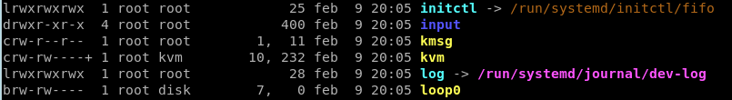
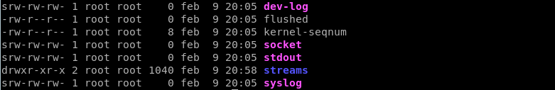
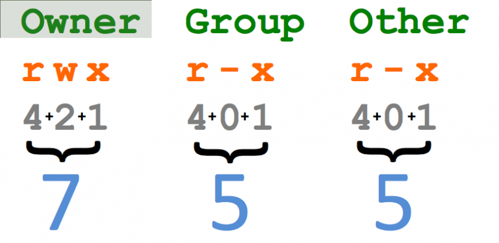

<!---
Ejemplos

<video class="stretch" controls><source src="http://clips.vorwaerts-gmbh.de/big_buck_bunny.mp4" type="video/mp4"></video>
<iframe width="560" height="315" src="https://www.youtube.com/embed/3RBq-WlL4cU" frameborder="0" allowfullscreen></iframe>

slide: data-background="#ff0000" 
element: class="fragment" data-fragment-index="1"
-->

# GNU/Linux
---

### Administración de equipos
<small> IES Luis Vélez de Guevara </small>


# Índice
--- 
## Introducción 
## Sistemas de archivos
## Interfaces de usuario
## Comandos

<!--- Note: Nota a pie de página. -->


# Intro
---
## Proyecto GNU 
## Kernel Linux
## Distribuciones
## Instalación


### Proyecto GNU
- Sistema operativo de tipo Unix.
- Acrónimo recursivo de "GNU's Not Unix"
- Iniciado en 1983 por Richard Stallman.
- Auspiciado por la Free Software Foundation.
- Propio núcleo llamado GNU Hurd.


### Proyecto GNU


Richard Stallman


### Núcleo Linux
- Concebido por Linus Torvalds en 1991.
- Desarrollado por colaboradores de todo el mundo.
- Distribuido bajo licencia GPL (de GNU Public License).
- Uno de los núcleos más ampliamente portados.
- Escrito en el lenguaje de programación C.


### Núcleo Linux


Linus Torvalds


### Distribuciones

- Dos grandes ramas:
 - Basadas en Debian. Paquetes .deb
 - Basadas en RedHat. Paquetes .rpm


### Distribuciones

[Evolución](http://futurist.se/gldt/wp-content/uploads/12.10/gldt1210.svg)


### Distribuciones


[distrowatch.com](http://distrowatch.com)


### Licencias
- Licencias propietarias
- Licencias "libres"
 - Documentación:  CC 
 - Bibliotecas o librerias: LGPL
 - Codigo fuente: GPL, Apache, BSD, MIT, ...


### Instalación
Pasos importantes en una instalación:
- Particionado (con instalación de GRUB)
- Creación de usuario


# Sistemas de archivos
---
## Formatos 
## Árbol de directorios


### Formatos
- ext2, ext3, ext4  <!-- .element: class="fragment" data-fragment-index="1" -->
- swap              <!-- .element: class="fragment" data-fragment-index="2" -->
- reiser, btrfs, xfs<!-- .element: class="fragment" data-fragment-index="3" -->
- vfat, exfat, ntfs <!-- .element: class="fragment" data-fragment-index="4" -->
- iso9660, udf      <!-- .element: class="fragment" data-fragment-index="5" -->
- nfs, cifs, smbfs  <!-- .element: class="fragment" data-fragment-index="6" -->
- ... y muchos otros<!-- .element: class="fragment" data-fragment-index="7" -->


### Árbol de directorios


### Árbol de directorios
```sh
tree
tree  directorio
tree  directorio  |  less
```


# Interfaces
---
## De texto
## Gráficas


## Interfaces de texto


### Interfaz de texto

- Terminales virtuales clásicos <!-- .element: class="fragment" data-fragment-index="1" -->
- Pseudoterminales              <!-- .element: class="fragment" data-fragment-index="2" -->


### Terminales virtuales clásicos 
- Más antiguos
- Normalmente 6 terminales disponibles
- Denominados __tty1, tty2, tty3, tty4, tty5 y tty6__
- Acceso mediante Ctrl+Alt+F1, Ctrl+Alt+F2, ..., Ctrl+Alt+F6
- Ctrl+Alt+F7 es el entorno gráfico


### Pseudoterminales
- Más modernos
- Pueden crearse muchos pseudoterminales
- Denominados __pts/0, pts/1, pts/2, ...__
- Acceso desde aplicación gráfica o red


### Sesiones de terminal abiertas
¿Quién está en el sistema y en que terminales?
```sh
who
```


## Interfaces gráficas


### Interfaz gráfica
- Mediante X-Window (servidor gráfico)
- Muchos tipos de escritorios
 - GNOME
 - KDE (Plasma)
 - Unity
 - XFCE
 - LXDE
 - Enlightenment
 - MATE, Cinnamon
 - ...y alguno más


# Comandos (I)
---
## Conceptos


### Introducción
- Innumerables comandos     <!-- .element: class="fragment" data-fragment-index="1" -->
- ... para innumerables usos<!-- .element: class="fragment" data-fragment-index="2" -->
- Muchos comandos externos  <!-- .element: class="fragment" data-fragment-index="3" -->
- ... y pocos comandos internos<!-- .element: class="fragment" data-fragment-index="4" -->


### Comandos externos vs internos
- Comandos externos principalmente en: 
 - /bin
 - /usr/bin
 - /sbin
 - /usr/sbin
- Comandos internos  ¿Dónde?
 - Dentro de /bin/bash


### Algunos comandos externos 
```sh
ls 
cp
mkdir
touch
nano
less
mv
rm
man
clear
reset
adduser
deluser
```


### Algunos comandos internos
```sh
cd 
pwd
help
echo
jobs
bg
fg
kill
history
exit
logout
type
```


### Comprobar si un comando es interno o externo
```sh
type  comando
```
Ejemplos
```sh
type  ls
type  cd 
type  type
type  man 
type  echo
type  mkdir
type  rm
```


### Synopsis
```
comando   [opciones]   [argumentos]
```


### Opciones
Opciones cortas
```
-h  -a  -l  ...
```
... se pueden agrupar sin un orden
```
-ahl
```
Opciones largas
```
--help  --verbose ...
```


### Argumentos
```
nombre_archivo  nombre_directorio  subcomando  ...
```


### Ayuda
Para comandos externos, __páginas de manual__
```sh
man
man  comando-externo
```
Para comandos internos, __páginas de ayuda__
```sh
help
help  comando-interno
```


### Uso de ayuda
Ejemplos
```sh
man  ls
man  adduser
man  shutdown
man  date
man  man 
```
```sh
help  cd
help  echo
help  kill
help  history
help  help 
```


# Comandos (II)
---
## Comandos básicos


### Identidad 
¿Quién soy?
```sh
whoami
```
Más información
```sh
id
```
¿Dónde estoy?
```sh
pwd
```


### Datos del S.O.
Version del nucleo (kernel) Linux
```sh
uname  -r
```
Sistema de 32 o 64 bits
```sh
uname  -m
```
Mas informacion
```sh
uname  -a
```
Distro
```sh
cat  /etc/issue
```


### Fecha, hora, calendario
Fecha y hora
```sh
date
```
Calendario de mes actual
```sh
cal
```
Calendario 2016
```sh
cal  2016
```


### Desplazarnos por el sistema 
```sh
pwd
cd  directorio_destino
```


### Rutas
- __Ruta absoluta__
 - Se inicia en el directorio raíz
 - __SIEMPRE comienza por /__
 - Es independiente del directorio actual
- __Ruta relativa__
 - Se inicia en el directorio actual
 - __NUNCA comienza por /__
 - Depende del directorio actual


### Desplazarnos por el sistema 
Estoy en /home/usuario
```sh
pwd
/home/usuario
```
Me desplazo usando una ruta relativa
```sh
cd   Escritorio
pwd
/home/usuario/Escritorio
```
Me desplazo usando una ruta absoluta
```sh
cd  /home/usuario/Descargas
pwd
/home/usuario/Descargas
```


### Desplazarnos por el sistema 
Voy al directorio raíz
```sh
cd  /
```
Atajo: Voy directo a mi directorio personal
```sh
cd  ~
```
Atajo: Lo mismo, pero más sencillo
```sh
cd 
```
Atajo: vuelvo al directorio anterior
```sh
cd  -
```


### Listado de un directorio
Listado de directorio actual
```sh
ls
```
Listado de otro directorio
```sh
ls  /ruta/absoluta/al/directorio
```
Listado de otro directorio
```sh
ls  ruta/relativa/al/directorio
```


### Listado de un directorio
Listado de todo el contenido (incluso oculto)
```sh
ls  -a
```
Listado largo
```sh
ls  -l
```
Listado largo de todo el contenido
```sh
ls  -la
```
Listado recursivo
```sh
ls  -R
```


### Ver contenido de archivos de texto
```sh
cat   nombre_archivo
more  nombre_archivo
less  nombre_archivo
nano  nombre_archivo
```


### Espacio ocupado por un directorio
```sh
du      directorio
du  -h  directorio
```


### Historial de comandos
```sh
history
```


### Limpiar o resetear terminal
Limpiar terminal
```sh
clear
```
Resetear terminal
```sh
reset 
```


### Instalar y desinstalar paquetes .deb
Buscar paquetes relacionados
```sh
apt-cache  search  paquete 
```
Mostrar datos de un paquete
```sh
apt-cache  show  paquete 
```
Instalar
```sh
apt-get  install  paquete
```
Desinstalar paquete
```sh
apt-get  remove  paquete
```


### Reiniciar o apagar
Reiniciar
```sh
reboot
shutdown  -r  now
```
Apagar
```sh
halt
shutdown  -h  now
```


# Comandos (III)
---
## Gestión de usuarios 


### Iniciar sesión
- Entorno de texto ... mediante __login__
- Entorno gráfico ... mediante __Display Manager__


### Display Managers
- Utilizados antes de cargar el escritorio
- Función equivalente a login para entorno gráfico
- Numerosos Display Managers
 - GDM  (para GNOME)
 - SSDM (para KDE. Antes usaba KDM)
 - LightDM
 - y muchos más


### Cerrar sesión en el terminal
```sh
exit
logout
```


### Alta de usuario
```sh
adduser  nombre_usuario
```

### Baja de usuario
```sh
deluser  nombre_usuario  --remove-home
```


### Cambiar contraseña
```sh
passwd
passwd  nombre_usuario
```


### Cambiar a otro usuario
```sh
su
su  nombre_usuario
```


### Elevación de privilegios
```sh
sudo  comando
sudo  -s
```


### Archivos importantes
```sh
/etc/passwd
/etc/shadow
```


# Comandos (IV)
---
## Gestión de archivos


### Listado largo 
```sh
ls  -l
```


### Tipos de "archivos"
```
d   directorio (directory)
-   archivo regular
l   enlace simbólico (link)
c   dispositivo de caracteres (char)
b   dispositivo de bloques (block)
p   tubería con nombre (pipe)
s   socket con nombre (socket)
```


### Directorios vs Archivos

__Los directorios contienen archivos y directorios__

__Los archivos contienen datos__


### Directorios "especiales"
```sh 
.   directorio actual
..  directorio padre o superior
/   directorio raíz
~   directorio personal de usuario
```


### Archivos regulares 
- Archivos binarios (normalmente sin extensión)
- Archivos de scripts (sh, py, ..., muchos sin extensión)
- Texto plano (txt, html, ...) 
- Texto con formato (doc, odt, ...)
- Imágenes (jpg, png, ...)
- Comprimidos (zip, tar.gz, tgz, ...)
- . . .

```sh 
file  nombre_archivo 
```


### Archivos especiales
- (l) Enlaces simbólicos
- (c) Dispositivos de caracteres
- (b) Dispositivos de bloques
- (p) Tubería con nombre
- (s) Socket con nombre


### Tipos de archivos especiales 







### Crear y eliminar enlaces simbólicos
Crear enlace simbólico
```sh
ln  -s  archivo_o_directorio_destino  nombre_enlace
```
Borrar enlace simbólico
```sh
rm  nombre_enlace
```
Ejemplo
```sh
ln  -s  /usr/share/doc   docs   # Crear enlace docs a /usr/share/doc
rm  docs                        # Borrar enlace docs
``` 


### Crear archivos y directorios vacíos
Crear archivos
```sh
touch  archivo1  archivo2 ...
```
Crear directorios
```sh
mkdir  directorio1  directorio2 ...
```


### Copiar archivos y directorios
Copiar un archivo en otro
```sh
cp  archivo_origen  archivo_destino
```
Copiar un archivo a un directorio
```sh
cp  archivo_origen  directorio_destino
```
Copiar varios archivos a un directorio
```sh
cp  archivo1_origen  archivo2_origen  directorio_destino
```
Copiar un directorio a otro directorio
```sh
cp  -R  directorio_origen  directorio_destino
```
Copiar contenido de un directorio a otro directorio
```sh
cp  -R  directorio_origen/*  directorio_destino
```


### Eliminar archivos y directorios (vacíos o no)
```sh
rm      archivo1     archivo2 ...
rm  -R  directorio1  directorio2 ...
```


### Cambiar nombre de archivos o directorios
Cambiar el nombre
```sh
mv  nombre_antiguo  nombre_nuevo 
```
... o mover de sitio
```sh
mv  nombre_antiguo  directorio_existente 
```


### Listado largo 


### Cambiar propietario
Comando chown
```sh
chown      usuario:grupo  archivo
chown  -R  usuario:grupo  directorio
```


### Permisos


### Cambiar permisos
Comando chmod
```sh
chmod      644  archivo
chmod  -R  755  directorio
```
[Página en Wikipedia](https://es.wikipedia.org/wiki/Chmod)


### Permisos




### Permisos

Número | Binario | Permisos
------:|:-------:|---------
__`0`__|__`000`__|__`---`__ 
`1`    |`001`    |`--x` 
`2`    |`010`    |`-w-` 
`3`    |`011`    |`-wx` 
__`4`__|__`100`__|__`r--`__ 
__`5`__|__`101`__|__`r-x`__ 
__`6`__|__`110`__|__`rw-`__ 
__`7`__|__`111`__|__`rwx`__ 


### Añadir o quitar permisos


### Añadir o quitar permisos
Ejemplos
```sh
chmod   g+w  archivo_o_directorio
chmod  ug+w  archivo_o_directorio
chmod ugo+x  archivo_o_directorio
chmod   a+x  archivo_o_directorio
chmod    +x  archivo_o_directorio
```


### Permisos especiales


### Montar un sistema de archivos
```sh
mount  -t  tipo   dispositivo_o_partición    punto_de_montaje
```
Ejemplo, para montar un pendrive suele valer
```sh
mount  /dev/sdb1   /mnt
```


### Desmontar un sistema de archivos
```sh
umount  dispositivo_o_partición_o_punto_de_montaje
```
Ejemplo, para desmontar un pendrive suele valer
```sh
umount  /mnt
```
o
```sh
umount  /dev/sdb1
```


### Dispositivos de bloques
```sh
/dev/sda      # Primer disco duro
/dev/sda1     # Primera partición del primer disco duro
/dev/sda2     # Segunda partición del primer disco duro
...
/dev/sdb      # Segundo disco duro o dispositivo extraible
/dev/sdb1     # Primera partición del segundo disco duro
/dev/sdb2     # Segunda partición del segundo disco duro
...
/dev/sdc      # Tercer disco duro o dispositivo extraible
/dev/sdc1     # Primera partición del tercer disco duro
/dev/sdc2     # Segunda partición del tercer disco duro
...
```


### Cerrar archivos abiertos
__CONSEJO:__ Usar __fuser__ para cerrar archivos abiertos.

- Si tenemos abierto algún archivo de un dispositivo que está montado, no podremos desmontar.
- Primero deberemos cerrar todos los archivos abiertos.

Ejemplo
```sh
fuser  -mk  /dev/sdb1
```
o
```sh
fuser  -mk  /mnt
```

ps `fuser -m  /dev/sdb1 2>1 | tr -s ' '`


# Comandos (V)
---
## Gestión de procesos


### Tuberias
__comando1 | comando2__

Ejemplos
```sh
cat /etc/passwd | sort
cat /etc/passwd | sort | less
cat /etc/passwd | cut -d : -f 1,5,7
cat /etc/passwd | cut -d : -f 1,5,7 | sort 
cat /etc/passwd | cut -d : -f 1,5,7 | sort | less
cat /etc/passwd | cut -d : -f 1,5,7 | grep /bin/.*sh 
ls -l       | tr -s ' ' | cut -d ' ' -f 1,9- 
ls -lR /tmp | tr -s ' ' | cut -d ' ' -f 1,9- | grep ^d
ls -lR /bin | tr -s ' ' | cut -d ' ' -f 1,9- | grep ^...s......
``` 


### Redirecciones
__comando >  archivo__

__comando >> archivo__

Ejemplos
```sh
ls  /home/usuario  >   listado
ls  /home/usuario  >>  listado
```


### Segundo plano
__comando &__

Ejemplos
```sh
ping  8.8.8.8  &
```
equivalente a 
```sh
ping  8.8.8.8
```
pulsar __Ctrl+Z para detener__ y
```sh
bg  1
```
para continuar ejecución en segundo plano


### Segundo plano
Pasar a primer plano
```sh
fg  1
```
pulsar __Ctrl+C para finalizar__


### Gestion de tareas
Listado de tareas
```sh
jobs
```
Pasar a segundo plano (background)
```sh
bg  numero_tarea
```
Pasar a primer plano (foreground)
```sh
fg  numero_tarea
```


### Listar procesos 
```sh
top
ps
ps  auxf
pstree
ps  auxf  |  less
pstree    |  less
pidof  lxterminal
pidof  gnome-terminal
pidof  firefox
```


### Matar procesos
```sh
kill      PID
kill  -9  PID
killall   firefox
xkill
```

