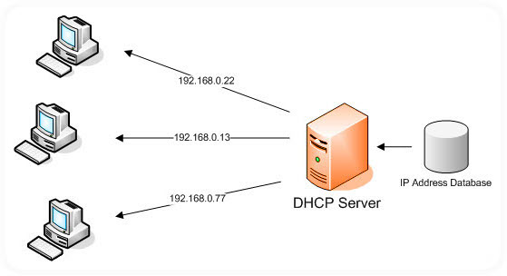
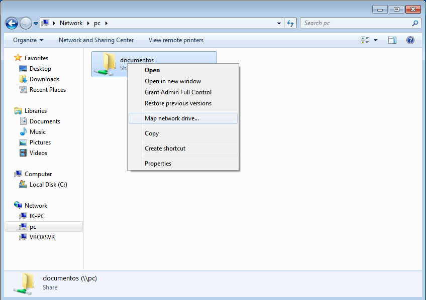
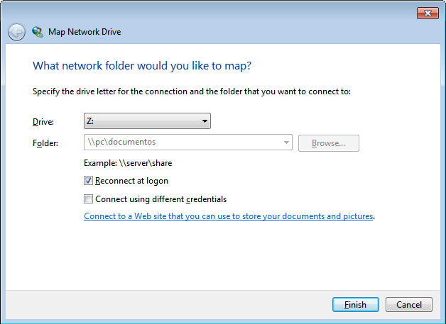
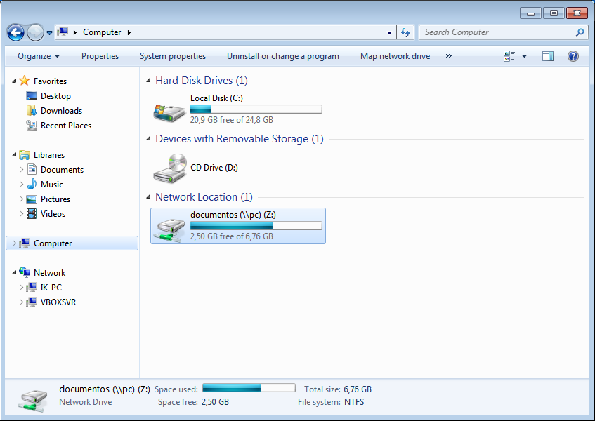
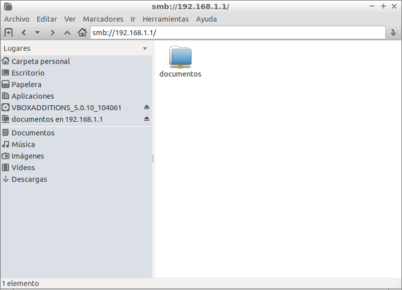

<!---
Ejemplos

<video class="stretch" controls><source src="http://clips.vorwaerts-gmbh.de/big_buck_bunny.mp4" type="video/mp4"></video>
<iframe width="560" height="315" src="https://www.youtube.com/embed/3RBq-WlL4cU" frameborder="0" allowfullscreen></iframe>

slide: data-background="#ff0000" 
element: class="fragment" data-fragment-index="1"
-->

# GNU/Linux
---

### Administración de red
<small> 2016 - IES Luis Vélez de Guevara - Écija - Spain </small>


# Licencia

[](http://creativecommons.org/licenses/by-sa/4.0/)

La versión más actualizada de este documento se encuentra en

[jamj2000.github.io](http://jamj2000.github.io/gnulinux/2/diapositivas)


# Índice
--- 
## Introducción
## Configuración
## Comandos de red
## Servicios de red

<!--- Note: Nota a pie de página. -->


# Intro
---
## Interfaces de red
## Parámetros de red
## Archivos de configuración


### Interfaces de red
- Un equipo puede tener varias __interfaces de red__
- Normalmente una sola interfaz de red tiene una única IP.
- A veces una sola interfaz de red puede tener varias IPs.


### Bucle local
- También se conoce como __loopback__
- Siempre existe.
- Su nombre es __`lo`__
- La dirección IP asociada es __127.0.0.1__
- Aunque podría ser cualquer 127.x.x.x
- No tiene salida a Internet.
- Sirve para pruebas en sitio local.


### Interfaces cableadas

```
eth0, eth1, eth2, ...

eno1, eno2, eno3, ...

enp0s0, enp0s1, enp0s2, ...
```


### Interfaces inalámbricas

```
wlan0, wlan1, wlan2, ...

wlo1, wlo2, wlo3, ...
```


### Parámetros de red

- Dirección IP y máscara 
- Puerta de enlace
- Servidores DNS


### Dirección IP y máscara
- Permite situar la interfaz de red en una red determinada.
- Ejemplo de dirección IP/máscara:

```
192.168.1.2     255.255.255.0

192.168.1.2/24
```


### Puerta de enlace
- Permite dar salida a otra red. 
- La puerta de enlace suele ser un router.
- Dicho router debe tener al menos 2 interfaces de red.
- E interconectar al menos 2 redes distintas.
- Ejemplo de puerta de enlace:

```
192.168.1.1
```


### Servidores DNS
- Permite resolver los nombres a direcciones IP.
- Obtienen la IP a partir de un nombre.
  - www.google.es --> 216.58.214.163
- Necesarios para la navegación web.
- Ejemplo de servidores DNS:

```
8.8.8.8

8.8.4.4
```


### Archivo de configuración
- Archivo donde se guardan los parámetros de red.
  - __/etc/network/interfaces__
- Ejemplo de archivo de configuración:
```
  # Configuración estática
  auto eth0
  iface eth0 inet static
     address 192.168.1.2
     netmask 255.255.255.0
     gateway 192.168.1.1
     dns-nameservers 8.8.8.8  8.8.4.4
  
  # Configuración dinámica
  auto eth1
  iface eth1 inet dhcp
```


### Servicio de red
- Cada vez que se modifique el archivo anterior debemos reiniciar el servicio de red.
```
/etc/init.d/networking  stop
/etc/init.d/networking  start
```
```
/etc/init.d/networking  restart
```


### Nombres de equipos

- Equipo local: __/etc/hostname__

- Otros equipos: __/etc/hosts__


# Config. de red
---
## Configuración estática
## Configuración dinámica


## Configuración dinámica
---
- Es necesario un servidor DHCP en la red.
- El equipo de usuario realiza 2 operaciones.

```bash
dhclient  -r  eth1    # Liberamos configuración de red

dhclient  eth1        # Renovamos configuración de red 
```


## Configuración estática
---
## Interfaces
## IP / Máscara
## Puerta de enlace
## Servidores DNS 


### Interfaces
__ifconfig__

```bash
ifconfig -s

ifconfig eth0 down 
ifconfig eth0 up    
```

__iproute2__

```bash
ip link show
ip l

ip link set eth0 down
ip link set eth0 up
```


### IP / Máscara
__ifconfig__

```bash
ifconfig

ifconfig eth0 192.168.1.2 netmask 255.255.255.0    
```

__iproute2__

```bash                      
ip address show
ip a

ip address add 192.168.1.2/24 dev eth0
```


### Puerta de enlace
__ route__

```bash
route

route add default gw 192.168.1.1
```

__iproute2__

```bash
ip route show
ip r

ip route add default via 192.168.1.1
```


### Servidores DNS
```bash
cat /etc/resolv.conf
```

```bash
echo "nameserver 8.8.8.8" >> /etc/resolv.conf
echo "nameserver 8.8.4.4" >> /etc/resolv.conf
```


# Comandos
---
- Ver/cambiar nombre de nuestro equipo
- Comprobar conectividad entre 2 equipos
- Ver ruta seguida entre 2 equipos
- Resolución de nombres a IP
- Comprobación de puertos locales
- Comprobación de puertos remotos


### hostname
- Para ver y establecer el nombre de nuestro equipo.
- __Los cambios no son permanentes__.
- Para ello deberíamos editar el archivo __/etc/hostname__
- Ejemplos de uso:

```bash
hostname

hostname portatil
```


### ping
- Comprueba la comunicación entre nuestro equipo y otro equipo remoto.
- Ejemplos de uso:

```bash
ping  192.168.1.1

ping  8.8.8.8

ping  www.yahoo.es
```


### traceroute
- Muestra la ruta entre nuestro equipo y otro equipo destino.
- Ejemplos de uso:

```bash
traceroute  8.8.8.8

traceroute  www.yahoo.es
```


### nslookup
- Comprueba la resolución de nombres a IP.
- Ejemplos de uso:

```bash
nslookup  www.yahoo.es

nslookup  www.yahoo.es  8.8.8.8
```


### dig
- Comprueba la resolución de nombres a IP.
- Más opciones que `nslookup`.
- Ejemplos de uso:

```bash
dig  www.yahoo.es

dig  @8.8.8.8  www.yahoo.es
```


### netstat
- Comprueba los puertos abiertos en nuestro equipo.
- Ejemplos de uso:

```bash
netstat  -punta

netstat  -tup
```


### nmap
- Comprueba los puertos abiertos en otro equipo.
- Ejemplos de uso:

```bash
nmap  -sP  192.168.1.0/24

nmap  -A -T4  192.168.1.1  192.168.1.10

nmap  192.168.1.1
```


# Servicios
---
- Algunos servicios que pueden implementarse en GNU/Linux.
 - Servidor web          <!-- .element: class="fragment" data-fragment-index="1" -->
 - Servidor FTP          <!-- .element: class="fragment" data-fragment-index="2" -->
 - Servidor DHCP         <!-- .element: class="fragment" data-fragment-index="3" -->
 - Servidor DNS          <!-- .element: class="fragment" data-fragment-index="4" -->
 - Servidor Samba        <!-- .element: class="fragment" data-fragment-index="5" -->
 - Servidor SSH          <!-- .element: class="fragment" data-fragment-index="6" -->
 - Servidor Proxy-caché  <!-- .element: class="fragment" data-fragment-index="7" -->


### Introducción
- Ver estado de un servicio

 ```bash
 service  nombre  status 
 ```

- Parar/Iniciar un servicio

 ```bash
 service  nombre  stop
 service  nombre  start
 ```

- Recargar/Reiniciar un servicio

 ```bash
 service  nombre  reload
 service  nombre  restart
 ```


## Servidor web


### Instalación

```sh
apt-get  install  apache2
``` 

### Configuración
__/etc/apache2/apache2.conf__
```
IncludeOptional mods-enabled/*.load
IncludeOptional mods-enabled/*.conf

Include ports.conf

<Directory /var/www/>
        Options Indexes FollowSymLinks
        AllowOverride None
        Require all granted
</Directory>

AccessFileName .htaccess

IncludeOptional conf-enabled/*.conf
IncludeOptional sites-enabled/*.conf
```


### Infraestructura LAMP


### Instalación
```sh
apt-get  install  apache2  mysql-server  php  php-mysql
```


### LAMP
- Permite el montaje de portales (CMS o SGC)
 - CMS: Content Management System 
 - SGC: Sistemas Gestores de Contenidos
- Ejemplos de SGC:
 - Joomla
 - Moodle
 - Wordpress
 - Prestashop
 - ownCloud
 - ... y muchos más


## Servidor DHCP



## Servidor Samba


### Instalación
```
apt-get  install  samba  smbclient  cifs-utils
```


### Configuración
__/etc/samba/smb.conf__

```
[global]
   workgroup = WORKGROUP
   server string = Servidor SMB/CIFS Linux

   security = user
   map to guest = Bad User

   log file = /var/log/samba/%m.log
   max log size = 50

[documentos]
   comment = "Carpeta compartida sin autenticación"
   path = /public
   public = yes
   only guest = yes
   writable = yes
```
```sh
chown  -R  nobody:nogroup  /public
```


### Comprobaciones

- Comprobamos sintaxis de archivo de configuración

 ```sh
 testparm
 ```

- Comprobamos conexión

 ```sh
 smbclient -L 192.168.1.1
 ```


### Windows - Mapeo de unidad red









### Linux - Montaje de unidad de red
```sh
mount   -t cifs   //192.168.1.1/documentos   /mnt
```





## Servidor SSH


### Instalación
```sh
apt-get install ssh
```

### Configuración
__/etc/ssh/sshd_config__
```
Port 22
Protocol 2

HostKey /etc/ssh/ssh_host_rsa_key
HostKey /etc/ssh/ssh_host_dsa_key
HostKey /etc/ssh/ssh_host_ecdsa_key
HostKey /etc/ssh/ssh_host_ed25519_key

PermitRootLogin prohibit-password

X11Forwarding yes

Banner /etc/issue
DenyUsers  usuario
```


### SSHFS - Instalación
```sh
apt-get install fuse sshfs
```

### Montaje y desmontaje manual
- Para montar usamos el comando sshfs

```sh
sshfs [usuario@]equipo:[dir] punto_montaje [opciones]
```

- Para desmontar usamos el comando fusermount

```sh
fusermount -u punto_montaje 
```


### Montaje y desmontaje automático

- Deberemos editar el archivo __/etc/fstab__.
- Ejemplo de configuración para acceder a particiones compartidas en una Raspberry Pi.

```
## Raspberry SSHFS  ## Modificar /etc/fuse.conf (user_allow_other)
# Dispositivo      # Punto montaje   # Tipo        # Opciones                                        #Volcado y pasada
pi@pi:/mnt/Datos1  /mnt/ssh/Datos1   fuse.sshfs    defaults,allow_other,uid=1000,gid=1000,_netdev    0  0
pi@pi:/mnt/Datos2  /mnt/ssh/Datos2   fuse.sshfs    defaults,allow_other,uid=1000,gid=1000,_netdev    0  0
```

