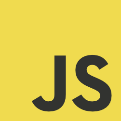

<!---
Ejemplos de inserción de videos

<video class="stretch" controls><source src="http://clips.vorwaerts-gmbh.de/big_buck_bunny.mp4" type="video/mp4"></video>
<iframe width="560" height="315" src="https://www.youtube.com/embed/3RBq-WlL4cU" frameborder="0" allowfullscreen></iframe>

slide: data-background="#ff0000" 
element: class="fragment" data-fragment-index="1"
-->

## HLC - Fullstack
---

<small> 2018-19 - IES Luis Vélez de Guevara - Écija - Spain </small>


## Introducción a Javascript

[](http://creativecommons.org/licenses/by-sa/4.0/)


## Índice
--- 
- ### Introducción
- ### Javascript básico
- ### Javascript intermedio
- ### Apuntes y ejemplos

<!--- Note: Nota a pie de página. -->


## Introducción


### En esta Unidad aprenderemos a

- Identificar los tipos básicos y los conceptos básicos de la programación funcional.
- Trabajar y realizar operaciones con arrays y objetos.
- Trabajar con el formato de intercambio de datos JSON.
- Hacer uso de AJAX.


## Javascript básico




### Introducción

- JavaScript y Java son lenguajes completamente diferentes, tanto en concepto como en diseño.
- JavaScript fue inventado por Brendan Eich en 1995.
- El estándar más importante actualmente es ECMAScript 6, ES6 o ES2015 (Año 2015) 
- En el estándar ES6 se incorporán: 
  - Modulos
  - Clases
  - Funciones flecha
  - Template strings


### Características

- lenguaje interpretado
- lenguaje con tipado dinámico
- lenguaje multiparadigma:
  - funcional
  - basado en prototipos
  - con soporte para objetos
- soporta ejecución asíncrona


### Tipos primitivos simples

- Números: enteros y reales.
- Texto
- Booleanos


**Ejemplos**
 
```javascript
var a;
typeof a;   // undefined

a = 23;
typeof a;   // number

a = 23.01;  
typeof a;   // number 

a = true; 
typeof a;   // boolean

a = "hola mundo";
typeof a;   // string
```


### Tipos compuestos

- Arrays:  `[   ]`
- Objetos:  `{   }`


**Ejemplos de arrays**

```javascript
var a;

a = [ 100, 200, 23 ]; 

typeof a;              // object
a instanceof Array;    // true 

a = [ 100, "hola", true ]; 

typeof a;              // object
a instanceof Array;    // true

// Los elementos están indexados, empezando en 0
a[0]   // 100
a[1]   // "hola"
a[2]   // true
```


**Ejemplos de objetos**

```javascript
var persona;

persona = { nombre:"José",  edad:30,  altura:170 };

typeof persona;              // object
persona instanceof Array;    // false

// Propiedades del objeto
persona.nombre   // "José"
persona.edad     // 30
persona.altura   // 170
```


### Funciones nominadas

```javascript
function suma (a, b) { return a + b; }  // Declaración o definición 

suma (2, 3);                            // Llamada o invocación                          

typeof suma;  // "function"
```


### Funciones anónimas

```javascript
//// FORMATO TRADICIONAL
// ¿Cómo hago una llamada a esta función?? 
function (a, b) { return a + b; }      

//// FORMATO DE FUNCIÓN FLECHA 
// expresada en forma de función flecha
(a, b) => { return a + b; }    

// expresada en forma de función flecha, simplificando return    
(a, b) => a + b;                   
```


## Javascript intermedio


### Ejecución asíncrona

- **Callbacks**
- **Promesas**
- **async / await**


### Callbacks

Un **callback** es una **función que es pasada como argumento a otra función**.


**Ejemplo 1**

```javascript
// Función que usaremos para el callback. 
// En este caso, NO es una función anónima.
function hola(){
  console.log ('Hola');
}

// La función hola será pasada como callback.
setTimeout (hola, 5000);  
setInterval(hola, 5000);  
```


**Ejemplo 2**

```javascript
// Usando una función anónima.

setTimeout ( function () { console.log ('Hola'); }, 5000);  
setInterval( function () { console.log ('Hola'); }, 5000);  
```


**Ejemplo 3**

```javascript
function callback (pos) {
    console.log (pos.coords.latitude, pos.coords.longitude);
}

if ("geolocation" in navigator) {
    navigator.geolocation.getCurrentPosition (callback);
} else {
    console.log ("No hay soporte de GPS");
}
```


**Ejemplo 4**

```javascript
// Usando una función anónima

if ("geolocation" in navigator) {
    navigator.geolocation.getCurrentPosition (       
      function (pos) { console.log (pos.coords.latitude, pos.coords.longitude); }
    );
} else {
    console.log ("No hay soporte de GPS");
}
```


### Promesas

Disponible a partir de ES6 (2015). 
La estructura del código es más clara que el uso de callbacks.


**Ejemplo 1**

```javascript
var URL = 'https://api.github.com/users/jamj2000';

function callback(response)  {
    console.log (response);
}

function error(err) {
    console.log(`Error devuelto: ${err.code} - ${err.message}`);
}

fetch(URL)
  .then(callback)
  .catch(error);
```


**Ejemplo 2**

```javascript
// Usando funciones anónimas
var URL = 'https://api.github.com/users/jamj2000';

fetch(URL)
  .then(function (response) { console.log (response); } )
  .catch(function (err) { console.log(`Error devuelto: ${err.code} - ${err.message}`); });
```

**Ejemplo 3**

```javascript
// Ejemplo completo
// Usando funciones anónimas
// Una vez recibida la respuesta hacemos una conversión a JSON

var URL = 'https://api.github.com/users/jamj2000';

fetch(URL)
  .then(function (response) { return response.json(); } )
  .then(function (data) { console.log (data); } )
  .catch(function (err) { console.log(`Error devuelto: ${err.code} - ${err.message}`); });
```


### async / await

Disponible a partir de ES7 (2016). 
Todavía se usa poco.


**Ejemplo**

```javascript
async function mensajes() {
  await mostrar('Este es el primer mensaje', 1000);
  await mostrar('Este es el segundo mensaje', 1500);
  await mostrar('Este es el tercer mensaje', 2000);
  await mostrar('Este es el cuarto mensaje', 800);
}

// Debe devolver una promesa, puesto que se va a usar dentro de una función async
function mostrar(mensaje, msEspera) {
  return new Promise((resolve, reject) => {
    setTimeout(() => {
      console.log(mensaje.toUpperCase()); resolve();
    }, msEspera)
  });
}

mensajes();
```


## Apuntes y ejemplos

https://github.com/jamj2000/javascript
