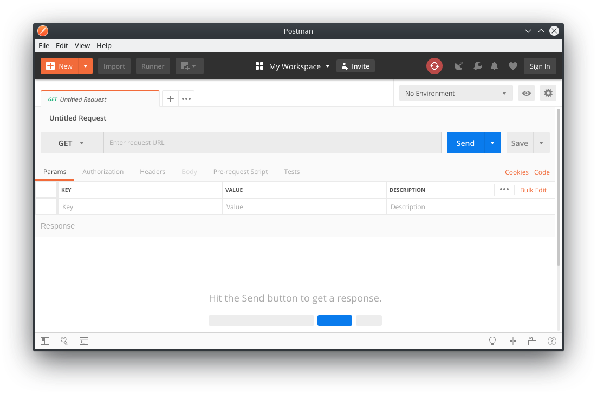
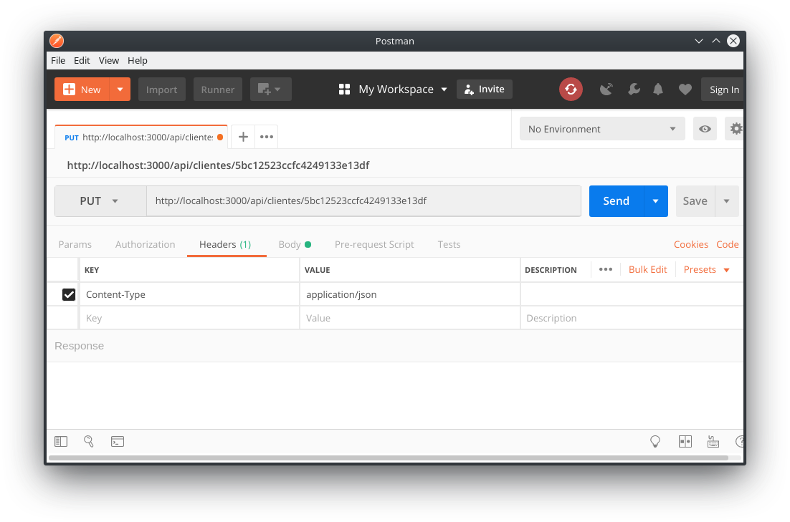

<!---
Ejemplos de inserción de videos

<video class="stretch" controls><source src="http://clips.vorwaerts-gmbh.de/big_buck_bunny.mp4" type="video/mp4"></video>
<iframe width="560" height="315" src="https://www.youtube.com/embed/3RBq-WlL4cU" frameborder="0" allowfullscreen></iframe>

slide: data-background="#ff0000" 
element: class="fragment" data-fragment-index="1"
-->
<!--- Note: Nota a pie de página. -->

## HLC - Fullstack
---

<p><small> IES Luis Vélez de Guevara - Écija - Spain </small></p>


## Backend con NodeJS y Express

[](http://creativecommons.org/licenses/by-sa/4.0/)


## Índice
--- 
- ### Introducción
- ### Node.js
- ### Rutas, Controladores y Modelos
- ### Ajustes finales
- ### Comprobando la API
- ### Despliegue


## Introducción


### En esta Unidad aprenderemos a

- Instalar y configurar el entorno de desarrollo.
- Gestionar las dependencias mediante el uso del gestor de paquetes.
- Elaborar una API RESTful.
- Hacer peticiones a la API desde distintos clientes.
- Definir el modelo de datos y acceder a la base de datos desde el código de la aplicación.


### Aplicación de ejemplo (I)

- Existe una aplicación funcional de ejemplo.
- El código está disponible en [`https://github.com/jamj2000/tiendabackend`](https://github.com/jamj2000/tiendabackend)
- Los archivos usados para el backend son:
  - **package.json**
  - **server.js**
  - **routes.js**
  - **controllers.js**
  - **models.js**
  - **.env**


### Aplicación de ejemplo (II)


## Node.js


### Motor Javascript V8


Node.js® es un **entorno de ejecución** para JavaScript construido con el **motor de JavaScript V8 de Chrome**.


### Instalación

**Entorno de ejecución**

```bash
sudo  apt  install  nodejs
```

**Gestor de paquetes**
```bash
sudo  apt  install  npm
```

Note: **npm** =  **N**ode **P**ackage **M**anager


### Inicio de un proyecto

```bash
mkdir  proyecto-node
cd     proyecto-node

npm  init  -y 
```

Note: La opción -y (--yes) de `npm init` crea un archivo **package.json** con opciones por defecto, sin hacer preguntas al usuario.


### Archivo package.json

```json
{
  "name": "proyecto-node",
  "version": "1.0.0",
  "description": "nodejs backend app",
  "main": "index.js",
  "scripts": {
    "test": "echo \"Error: no test specified\" && exit 1"
  },
  "keywords": [],
  "author": "jamj2000",
  "license": "ISC",
  "dependencies": {
    "express": "^4.16.4"
  },
  "devDependencies": {
    "nodemon": "^1.18.4"
  }
}
```


### Instalación de módulos

```
     npm  install  express      -S  
     npm  install  nodemon      -D  
sudo npm  install  json-server  -g  
```

o de forma más corta

```
     npm  i  express     -S  
     npm  i  nodemon     -D  
sudo npm  i  json-server -g
```


### Opciones

**-S,  --save**
- dependencia de aplicación. Añade entrada en archivo `package.json`. En las últimas versiones de `npm` no es necesaria esta opción.

**-D,  --save-dev**
- dependencia de desarrollo. Añade entrada en archivo `package.json`.

**-g,  --global**
- instala en el sistema de forma global. Se usa normalmente para paquetes ejecutables.


### Desinstalación de módulos

```
     npm  remove  express
     npm  remove  nodemon     -D 
sudo npm  remove  json-server -g 
```   
o de forma más corta

```
     npm  r  express 
     npm  r  nodemon     -D  
sudo npm  r  json-server -g
```


### npx (I)

- Herramienta de ejecución de paquetes que viene con **npm 5.2+**.
- **Ejecuta** paquetes ejecutables de `node.js` sin necesidad de instalarlos.
- Es más cómodo que usar `sudo npm install -g ...`
- Ejemplo (lanzar servidor web):
  - Usando `sudo npm install -g ...`:
  ```
  sudo npm  install  -g  http-server
  http-server
  ```
  - Usando `npx  ...`:
  ```
  npx  http-server
  ```


### npx (II)

#### Ejemplos

```
npx  serve                     # Inicia un servidor web
npx  http-server               # Inicia otro servidor web
npx  live-server               # Inicia otro servidor web con recarga de archivos modificados
npx  json-server               # Inicia un servidor JSON (API REST). Consultar https://www.npmjs.com/package/json-server

npx  @angular/cli  new         nombre-proyecto  # Iniciar proyecto de Angular 
npx  create-react-app          nombre-proyecto  # Iniciar proyecto de React 
npx  @vue/cli  create          nombre-proyecto  # Iniciar proyecto de Vue
npx  degit  sveltejs/template  nombre-proyecto  # Iniciar proyecto de Svelte   
```


### Módulos incorporados (built-in)

- No es necesario instalarlos.
- Ya vienen con node.js.
- Ejemplos:
  - **fs**:  Sistema de archivos
  - **http**:  Servidor HTTP
  - **https**:  Servidor HTTPS
  - **os**:  Sistema operativo
  - **path**:  Rutas de archivos
  - **process**:  Información y control del proceso actual
  - ...

Mas info: https://www.w3schools.com/nodejs/ref_modules.asp


## El servidor web

- Node.js nos permite desarrollar un servidor web desde cero.
- Para ello puede usarse el módulo incorporado `http`.
- Sin embargo es más recomendable, por su sencillez, usar el **framework `express`**.


### Un servidor sencillo

**server1.js**

```javascript
var app  =  require('express')();

app.get ('/hola', (req, res) => { 
    res.send ('Hola mundo') 
});

app.get ('/hola/:usuario', (req, res) => { 
    res.send (`<h1>Buenos días, ${req.params.usuario}</h1>`); 
});

app.listen (3000);
```

Ejecutar:

```bash
node  server1
```


### Otro servidor sencillo  

**server2.js**

```javascript
// --- IMPORTACIONES
const path     = require('path');
const express  = require('express');
const morgan   = require('morgan');

const app      = express();

// --- MIDDLEWARE
// Archivos estáticos. Deberás crear un archivo public/index.html para ver el resultado
app.use(express.static(path.join(__dirname , 'public')));

app.use(express.json()); // Soporte de JSON
app.use(morgan('dev'));  // Logger

// --- INICIAR SERVIDOR
app.listen (3000, () => console.log('Servidor iniciado en puerto 3000'));
```

Ejecutar:

```bash
node  server2
```


### Conexión a la BD

**server.js**

```javascript
const mongoose = require('mongoose');

mongoose.connect('mongodb://localhost:27017/basedatos', { useNewUrlParser: true })
  .then(db   => console.log ('Conexión correcta a la BD'))
  .catch(err => console.log ('Error en la conexión a la BD'));
```


## Rutas, Controladores y Modelos


### Los modelos

**models.js**

```javascript
const mongoose = require('mongoose');

const Cliente = mongoose.model('Cliente',
  new mongoose.Schema({ nombre: String, apellidos: String })
);

const Articulo = mongoose.model('Articulo',
  new mongoose.Schema({ nombre: String, precio: Number })
);

module.exports =  { Cliente, Articulo };
```


### Las rutas

**routes.js**

```
const express = require("express");
const controller = require("./controllers.js");

const router = express.Router();

router.get    ("/clientes",      , controller.readClientes);   // Read All
router.get    ("/clientes/:id",  , controller.readCliente);    // Read
router.delete ("/clientes/:id",  , controller.deleteCliente);  // Delete
router.put    ("/clientes/:id",  , controller.updateCliente);  // Update
router.post   ("/clientes",      , controller.createCliente);  // Create

module.exports = router;
```


### Los controladores

**controllers.js**

```javascript
const { Cliente, Articulo } = require("./models.js");

exports.readClientes   = (req, res) => Cliente.find             ( ... );
exports.readCliente    = (req, res) => Cliente.findOne          ( ... );
exports.deleteCliente  = (req, res) => Cliente.findOneAndDelete ( ... );
exports.updateCliente  = (req, res) => Cliente.findOneAndUpdate ( ... );
exports.createCliente  = (req, res) => new Cliente({ nombre: req.body.nombre, apellidos: req.body.apellidos })
                                           .save ( ... );

```


### Operaciones CRUD

| CRUD     |  HTTP    | MongoDB   | Mongoose                     |
|----------|----------|-----------|------------------------------|
| Create   | POST     | insert    | objeto.save                  |
| Read     | GET      | find      | Modelo.find / Modelo.findOne |
| Update   | PUT      | update    | Modelo.findOneAndUpdate      |
| Delete   | DELETE   | remove    | Modelo.findOneAndRemove      |


### Ejemplo find

```javascript
    Cliente.find({}, (err, data) => {
        if (err) res.json({ error: err });
        else     res.json(data);
    });
```


### Ejemplo findOne

```javascript
    Cliente.findOne({ _id: req.params.id }, (err, data) => {
        if (err) res.json({ error: err });
        else     res.json(data);
    });
```


### Ejemplo findOneAndDelete

```javascript
    Cliente.findOneAndRemove({ _id: req.params.id }, (err, data) => {
        if (err) res.json({ error: err });
        else     res.json(data);
    });
```


### Ejemplo findOneAndUpdate

```javascript
    Cliente.findOneAndUpdate (
      {_id: req.params.id}, 
      {$set: { nombre: req.body.nombre, apellidos :req.body.apellidos }}, 
      (err, data) => {
        if (err) res.json({ error: err });
        else     res.json(data);
    });
```


### Ejemplo save

```javascript
    new Cliente({ nombre: req.body.nombre, apellidos: req.body.apellidos })
    .save((err, data) => {
        if (err) res.json({ error: err });
        else     res.json(data);
    });
```


## Ajustes finales


### Estableciendo las rutas 

**server.js**

```javascript
const routes = require('./routes');

// Rutas
app.use ('/api', routes);
```


### Variables de configuración

- Para facilitar el mantenimiento y despliegue de la aplicación, situamos todos los parámetros de configuración en el archivo **`.env`**
- El archivo `.env` contiene variables de entorno (`environment variables`)
- El archivo `.env` debe añadirse a `.gitignore` para evitar añadirlo al repositorio.
- El archivo `.env` puede contener URLs, nombres de usuarios, contraseñas, ...

- Ejemplo:
```
DB_URI=mongodb://localhost:27017/basedatos
PORT=3000
```


### Acceso a las variables

- En el archivo **`server.js`** leemos las variables anteriores.
- Para ello necesitamos hacer uso del módulo `dotenv`.

```javascript
require('dotenv').config();

const PORT = process.env.PORT || 3000;
const DB_URI = process.env.DB_URI;

mongoose.connect(DB_URI, { useNewUrlParser: true })
  .then(db   => console.log ('Conexión correcta a la BD'))
  .catch(err => console.log ('Error en la conexión a la BD'));

app.listen (PORT, 
            () => console.log(`Servidor iniciado en puerto ${PORT}`));
```


## Comprobando la API

- Para hacer consultas a la API RESTful usaremos 3 métodos:
  - **curl**
  - **DevTools del navegador**
  - **Postman**


### curl (I)

Aplicación que nos permite realizar peticiones HTTP de tipo **POST**, **GET**, **PUT**, **DELETE**, y muchas otras, de forma directa desde **terminal de texto**.


### curl (II)

```bash
# GET
curl  http://localhost:3000/api/articulos
curl -H 'Content-Type: application/json' \
     -X GET http://localhost:3000/api/articulos

# POST
curl -H 'Content-Type: application/json' \
     -X POST -d '{"nombre": "Botas de invierno","precio": 99.99}' \
     http://localhost:3000/api/articulos

# PUT
curl -H 'Content-Type: application/json' \
     -X PUT -d '{"nombre": "Paraguas","precio": 100.20}' \
     http://localhost:3000/api/articulos/5b609c52c60bd6656205e3d7

# DELETE
curl -H 'Content-Type: application/json' \
     -X DELETE http://localhost:3000/api/articulos/5b609c52c60bd6656205e3d7
```


### DevTools del navegador (I)

Mediante código javascript podemos realizar peticiones HTTP de tipo **POST**, **GET**, **PUT**, **DELETE**, y alguna otra. Si el servidor no tiene habilitado `CORS`, deberemos tener abierta en el navegador alguna página del dominio para realizar peticiones desde el mismo origen.


### DevTools del navegador (II)

```javascript
fetch('/api/clientes', { method: 'GET' })
  .then ( res => res.json())
  .then ( data => console.log(data) );

fetch('/api/clientes/5b4916cb2100bc25330b6ac9', { method: 'GET' })
  .then ( res => res.json())
  .then ( data => console.log(data) );

fetch('/api/clientes/5b49b5e33808be1b00b982e2', { method: 'DELETE' })
  .then ( res => res.json())
  .then ( data => console.log(data) );
```


### DevTools del navegador (III)

```javascript
var cliente = { nombre: "Isabel", apellidos: "López" };

fetch('/api/clientes', {
  method: 'POST',
  body: JSON.stringify(cliente), 
  headers:{
    'Content-Type': 'application/json'
  }
})
  .then(res => res.json())
  .then(data => console.log(data))
```


### DevTools del navegador (III)

```javascript
var cliente = { nombre: "Pepe", apellidos: "Pérez" };

fetch('/api/clientes/5b4916cb2100bc25330b6ac9', {
  method: 'PUT',
  body: JSON.stringify(cliente), 
  headers:{
    'Content-Type': 'application/json'
  }
})
  .then(res => res.json())
  .then(data => console.log(data));
```


### Postman

Aplicación que nos permite realizar peticiones HTTP de tipo **POST**, **GET**, **PUT**, **DELETE**, y muchas otras, de forma sencilla, cómoda y gráfica.


### Postman: Instalación

- Descargar de la página oficial: https://www.getpostman.com/apps
- Descomprimir
- Ejecutar `Postman/Postman`


###  Postman: Ejecución




###  Postman: POST Header


###  Postman: POST Body


###  Postman: PUT Header




###  Postman: PUT Body


## Despliegue

- **API REST**: Heroku
- **BD Mongo**: Mongo DB Atlas


### 

