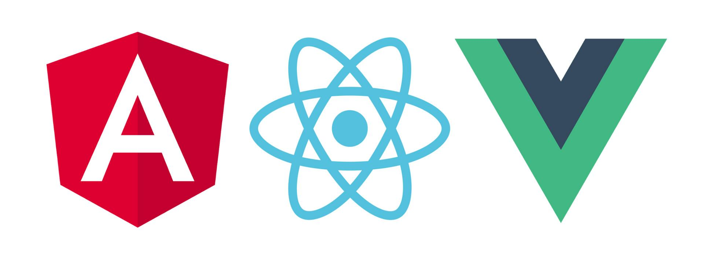

<!---
Ejemplos de inserción de videos

<video class="stretch" controls><source src="http://clips.vorwaerts-gmbh.de/big_buck_bunny.mp4" type="video/mp4"></video>
<iframe width="560" height="315" src="https://www.youtube.com/embed/3RBq-WlL4cU" frameborder="0" allowfullscreen></iframe>

slide: data-background="#ff0000" 
element: class="fragment" data-fragment-index="1"
-->

## HLC - Fullstack
---

<small> 2018-19 - IES Luis Vélez de Guevara - Écija - Spain </small>


## Frontend con VanillaJS

[](http://creativecommons.org/licenses/by-sa/4.0/)


## Índice
--- 
- ### Introducción
- ### Frameworks
- ### VanillaJS
- ### Ejemplo

<!--- Note: Nota a pie de página. -->


## Introducción


### En esta Unidad aprenderemos a

- Utilizar las nuevas características de ECMAScript6. 
- Manipular el DOM.
- Gestionar distintos tipos de eventos.
- Realizar peticiones asíncronas de datos.


### Tipos de aplicaciones

**desde el punto de vista del usuario**

- **MPA** (Mutiple Page Application)
- **SPA** (Single Page Application)


### MPA


- Suelen seguir la arquitectura MVC (Modelo-Vista-Controlador)
- Mayor carga en el servidor.
- Es el servidor el que genera las vistas.

[MVC en Wikipedia](https://es.wikipedia.org/wiki/Modelo%E2%80%93vista%E2%80%93controlador)


### SPA


- Se libera de carga al servidor.
- Es el cliente el que genera la vista con los datos que obtiene del servidor.
- Es imprescindible el uso de AJAX.

[SPA en Wikipedia](https://es.wikipedia.org/wiki/Single-page_application)


### Aplicación de ejemplo

- Versión de estudio:

  - [TiendaW - Código](https://github.com/jamj2000/tiendaw)
  - [TiendaW - Demo](http://tiendaw.herokuapp.com)

- Otra versión:

  - [Tienda0 - Código](https://github.com/jamj2000/tienda0)
  - [Tienda0 - Demo](http://tienda0.herokuapp.com)


## Frameworks

Los más usados actualmente (Enero 2018)

- **Angular** (Google) 
- **React** (Facebook)
- **Vue**


### Características generales



- Frameworks exclusivos para desarrollo Frontend.
- Permiten crear y mantener aplicaciones web de una sola página (SPA).
- Pueden integrarse en Backend de muchos tipos: `nodejs`, `.NET`, `PHP`, ...


### Angular

- De código abierto.
- Desarrollo en **TypeScript**.
- Permite el desarrollo por componentes.
- Mantenido por Google.
- Existe el framework `Angular Ionic` para desarrollo de aplicaciones híbridas para móvil.

[Wikipedia](https://es.wikipedia.org/wiki/AngularJS)


### React

- De código abierto.
- Ofrece un **Virtual DOM**.
- Ofrece un lenguaje específico del contexto llamado **JSX**.
- Permite el desarrollo por componentes.
- Mantenido por Facebook.
- Existe el framework `React Native` para desarrollo de aplicaciones híbridas para móvil.

[Wikipedia](https://es.wikipedia.org/wiki/React)


### Vue

- De código abierto.
- Gran facilidad y simplicidad de uso.
- Ofrece **templates .vue** (HTML, JS y CSS, todo en un archivo).
- Permite el desarrollo por componentes.
- Usado por Xiaomi, Alibaba, Gitlab, ...

[Wikipedia en inglés](https://en.wikipedia.org/wiki/Vue.js)

[Características de Vue](https://www.genbeta.com/desarrollo/por-que-elegir-vuejs-5-razones-para-considerarlo-nuestro-proximo-framework-de-referencia)


## VanillaJS

- Javascript puro, sin uso de frameworks.
- Menor abstracción que usando frameworks.
- Mejor para proyectos pequeños.
- Mejor para aprender el lenguaje JS.
- Manipulación directa del DOM.
- Gestión directa de eventos.


### Descarga 

- VanillaJS es un "framework" muy potente. 😉
- Pesa muy, muy poco.
- Y ofrece muchas funcionalidades.
- Puedes descargarlo desde http://vanilla-js.com/ 


## Ejemplo

**Archivos**

- **index.html**
- **style.css**
- **app.js**


### HTML

**index.html**

```html
    <html lang="es">
    <head>
        <meta charset="UTF-8">
        <title>Tienda</title>
    </head>

    <body>
    <nav>
        <input name="menu-opcion" type="radio" id="menu-inicio" checked>
        <label for="menu-inicio" id="menu-inicio-label"> <span> 🏠 </span></label>
        <input name="menu-opcion" type="radio" id="menu-articulos">
        <label for="menu-articulos" id="menu-articulos-label"> <span> 🛒 </span></label>
        <input name="menu-opcion" type="radio" id="menu-clientes">
        <label for="menu-clientes" id="menu-clientes-label"> <span> 👤 </span></label>
    </nav>

    <main id="contenido">
        <div class="seccion" id="inicio"></div>
        <div class="seccion" id="articulos"></div>
        <div class="seccion" id="clientes"></div>
    </main>

    <div id="OK"> 😊 </div>
    <div id="KO"> 😟 </div>

    <script src="app.js"></script> <!-- Interfaz de interacción con el usuario -->
    </body>
    </html>
```


### Javascript (I)

**app.js**

```javascript
window.addEventListener('load', function () {
    // Inicialización ...

    // Establecemos los escuchadores de eventos
    document.getElementById('menu-inicio').addEventListener('click', function (e) {
       // ...
    });

    document.getElementById('menu-articulos').addEventListener('click', function (e) {
       // ...
    });

    document.getElementById('menu-clientes').addEventListener('click', function (e) {
       // ...
    });
}
```


### Javascript (II)

**app.js**

```javascript
//  OPERACION CRUD - CREATE
function insertar(coleccion, objeto) {
    if (Object.values(objeto).every(x => (x !== null && x !== ''))) {
    
        fetch(`/api/${coleccion}`,
            {
                method: 'POST',
                headers: { 'Content-Type': 'application/json' },
                body: JSON.stringify(objeto)
            })
            .then(res => res.json())
            .then(data => {
               // ...
            })
            .catch(err => {
               // ...
            });

    }
}
```


### Javascript (III)

**app.js**

```javascript
//  OPERACION CRUD - READ

function verDocumentos(coleccion) {
    fetch(`/api/${coleccion}`,
        {
            method: 'GET'
        })
        .then(res => res.json())
        .then(data => {
            document.getElementById(`${coleccion}`).innerHTML
                = json2table(coleccion, data, "table-responsive-full sort-table")
        })
}
```


### Javascript (IV)

**app.js**

```javascript
//  OPERACION CRUD - UPDATE
function modificar(coleccion, id, objeto) {
    // let objeto = { nombre: campo1, precio: campo2 };

    fetch(`/api/${coleccion}/${id}`,
        {
            method: 'PUT',
            headers: { 'Content-Type': 'application/json' },
            body: JSON.stringify(objeto)
        })
        .then(res => res.json())
        .then(data => {
               // ...
        })
        .catch(err => {
               // ...
        });

}
```


### Javascript (V)

**app.js**

```javascript
//  OPERACION CRUD - DELETE
function eliminar(coleccion, id) {
    // if (confirm("El documento para " + documento.nombre + " va a ser eliminado. ¿Está seguro?")) {
    fetch(`/api/${coleccion}/${id}`,
        {
            method: 'DELETE'
        })
        .then(res => res.json())
        .then(data => {
               // ...
        })
        .catch(err => {
               // ...
        });
    // }
}
```