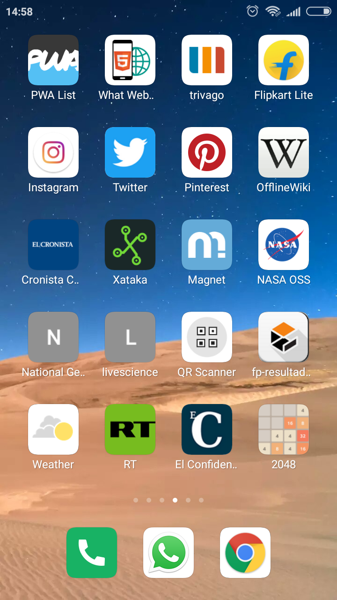
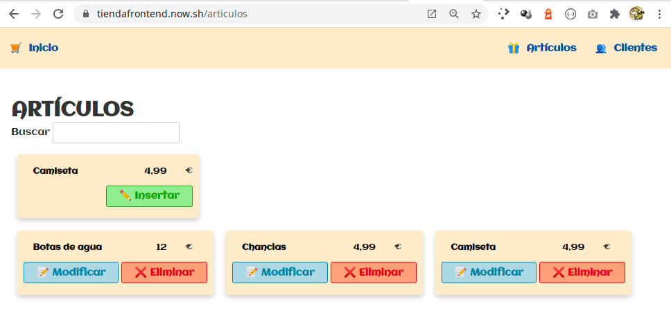

<!---
Ejemplos de inserción de videos

<video class="stretch" controls><source src="http://clips.vorwaerts-gmbh.de/big_buck_bunny.mp4" type="video/mp4"></video>
<iframe width="560" height="315" src="https://www.youtube.com/embed/3RBq-WlL4cU" frameborder="0" allowfullscreen></iframe>

slide: data-background="#ff0000" 
element: class="fragment" data-fragment-index="1"
-->

## HLC - Fullstack
---

<small> 2018-19 - IES Luis Vélez de Guevara - Écija - Spain </small>


## Desarrollo para dispositivos móviles

[](http://creativecommons.org/licenses/by-sa/4.0/)


## Índice
--- 
- ### Introducción
- ### Desarrollo para móvil
- ### Aplicaciones Web Progresivas (PWA)

<!--- Note: Nota a pie de página. -->


## Introducción


### En esta Unidad aprenderemos a

- Valorar la tecnología de aplicación web progresiva (PWA).
- Crear el archivo `manifest.json` e identificar los archivos que conforman la `App Shell`.
- Generar el `Service Worker` y comprobar sus eventos asociados.
- Comprobar el correcto cacheo de los datos.
- Desplegar la aplicación.


## Desarrollo para móvil


### Tipos de desarrollo

- Aplicaciones nativas 
- Aplicaciones híbridas
- Aplicaciones web progresivas (PWA)


### Aplicaciones nativas

- Desarrollada y optimizada específicamente para un sistema operativo determinado.
- Es necesario desarrollar por separado para cada plataforma (Android, iOS, ...)
- Se adapta al 100% con las funcionalidades y características del dispositivo.
- Mayor coste de desarrollo. 
- Es necesario conocer lenguajes como Java, Swift y sus SDKs asociados.
- Existe una tienda centralizada de APPs.


### Aplicaciones híbridas

- Muy versátil, desarrollo web con capacidad de adaptación al dispositivo.
- Rendimiento ligeramente inferior a una aplicación nativa.
- Menor coste de desarrollo que una aplicación nativa.
- Se desarrolla usando HTML5, JS, CSS y posiblemente también parte en Android o Swift.
- Suele usarse algún framework como Cordova, Angular Ionic o React Native.


### Aplicaciones Web Progresivas I

- Desarrollo más sencillo.
- Buen rendimiento, equiparable a una aplicación nativa.
- Mínimo coste de desarrollo.
- **Desarrollo multiplaforma real: Web, Escritorio y Móvil**.
- Uso de "**responsive web design**", para adaptar a distintos tamaños de pantalla.
- Necesidad de adaptar la aplicación a pantalla de móviles y también de PC.
- Todo el desarrollo se realiza en HTML5, JS y CSS.
- Deben funcionar sobre **HTTPS**.


### Aplicaciones Web Progresivas II

- No hay necesidad de una tienda de aplicaciones. 
- Pueden instalarse desde el sitio web de la aplicación.
- Una vez instaladas, aparecen en la pantalla de inicio del usuario.
- Ofrecen una experiencia de pantalla completa inmersiva.
- Fidelización de usuarios al ofrecer notificaciones push.


### Aplicaciones Web Progresivas III

#### Características

- **Confiable** (Reliable). Carga instantánea incluso con condiciones de red inciertas.
- **Rápida** (Fast). Respuesta rápida a la intereacción con el usuario con animaciones suaves.
- **Atractiva** (Engaging). Experiencia de usuario inmersiva.

https://developers.google.com/web/progressive-web-apps/


### Aplicaciones Web Progresivas IV

#### Ejemplo

- [Demo de Tiendaw en Heroku](https://tiendaw.herokuapp.com/)
- [Código fuente de Tiendaw en GitHub](https://github.com/jamj2000/tiendaw)


### Diseño responsive (web adaptativas)

- Framework CSS **Bootstrap**
- Framework CSS **Materialize**
- CSS puro. Mediante el empleo de **media queries**.


### ¿Qué puede hacerse con tecnologías web?

https://whatwebcando.today/


### Un pequeño listado de PWA
https://pwa.rocks/




## Aplicaciones Web Progresivas (PWA)

- Archivo **manifest.json**
- **App Shell**
- **Service Worker**
- **Push Notifications**


### PWA: manifest.json

- Archivo en formato JSON.
- Indica la apariencia de la aplicación y cómo se inicia.
- Puede especificar:
  - los iconos de la pantalla de inicio
  - la página que se cargará cuando se inicie la aplicación
  - la orientación de la pantalla
  - e incluso si desea mostrar o no el navegador Chrome.

https://app-manifest.firebaseapp.com/


### PWA: App Shell

- Es la mínima cantidad de **HTML, CSS y JavaScript** requeridos para activar la interfaz de usuario. Es el esqueleto de tu IU.
- Contiene los componentes principales necesarios para poner en marcha tu app.
- Probablemente no contenga los datos.
- Cuando se almacena en caché sin conexión puede asegurar un rendimiento instantáneo y de alta confiabilidad.


### PWA: Service Worker

- Es como un proxy del lado del cliente.
- Controla la memoria caché y responde a las solicitudes de recursos por parte del cliente. 
- Al pre-almacenar en caché los recursos clave, puede eliminar la dependencia de la red, asegurando una experiencia instantánea y confiable para sus usuarios.


### PWA: Push Notifications I

- Es un mensaje que aparece en un dispositivo móvil. 
- El publicador de la aplicación puede enviarlas en cualquier momento.
- Los usuarios no tienen que estar en la aplicación o usar sus dispositivos para recibirlas.
- Son similares a mensajes de texto SMS y alertas móviles, pero solo llegan a los usuarios que han instalado la aplicación.


### PWA: Push Notifications II

#### Usos más habituales

- Últimas noticias y resultados deportivos en el momento del evento.
- Mensajes de utilidad como el tráfico o el clima.
- Registro de vuelos, cambios, cancelaciones, ...


### PWA: Push Notifications III

#### Características

- Precisa
- Oportuna
- Relevante


### PWA: Despliegue en internet

#### Instrucciones

- [Instrucciones para desplegar en Heroku+mLab la aplicación Tiendaw](https://github.com/jamj2000/tiendaw#despliegue-en-heroku--mlab)


#### A tener en cuenta


#### A tener en cuenta

**config.js**
```javascript
// El primer valor es para PRODUCCIÓN, el alternativo para DESARROLLO

module.exports = {
  ip         : process.env.HOST   || '0.0.0.0',
  port       : process.env.PORT   || 3000,
  db_uri     : process.env.DB_URI || 'mongodb://localhost:27017/tiendaw'
};
```


### PWA: Instalación en PC y móvil

#### Ejemplo para PC




#### Ejemplo para Móvil

