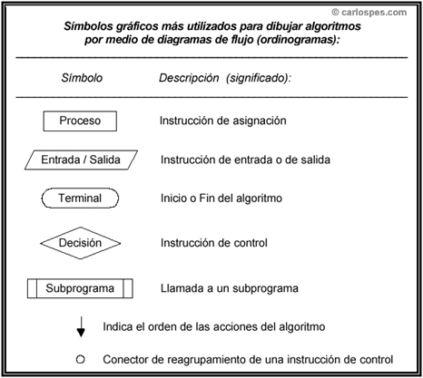
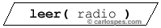
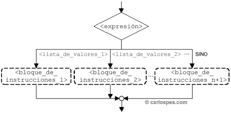
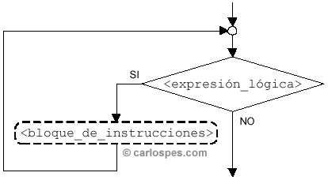
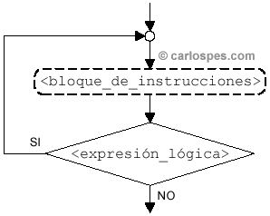
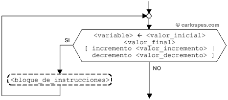
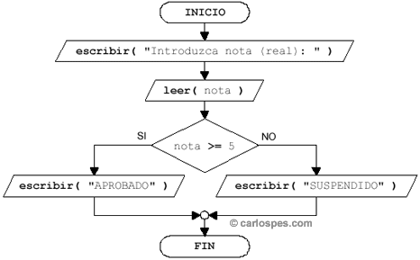
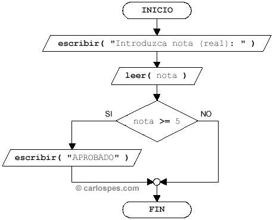
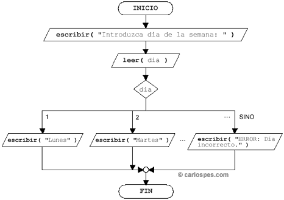

<!---
Ejemplos de inserción de videos

<video class="stretch" controls><source src="http://clips.vorwaerts-gmbh.de/big_buck_bunny.mp4" type="video/mp4"></video>
<iframe width="560" height="315" src="https://www.youtube.com/embed/3RBq-WlL4cU" frameborder="0" allowfullscreen></iframe>

slide: data-background="#ff0000" 
element: class="fragment" data-fragment-index="1"
-->

## HLC - PHP
---

<p><small> IES Luis Vélez de Guevara - Écija - Spain </small></p>


## Programación estructurada

[](http://creativecommons.org/licenses/by-sa/4.0/)


## Índice (I)
--- 
- ### Algoritmos y ordinogramas
- ### Entorno de desarrollo
- ### Entrada y salida
- ### Tipos de datos
- ### Estructuras alternativas
- ### Estructuras repetitivas
- ### Funciones 

<!--- Note: Nota a pie de página. -->


## Introducción


### En esta Unidad aprenderemos a

- Diferenciar algoritmo y programa.
- Identificar mediante ordinograma un algoritmo.
- Reconocer los tipos de datos básicos.
- Trabajar con variables y constantes.
- Trabajar con estructuras de control alternativas y repetitivas.
- Trabajar con funciones.


## Algoritmos y ordinogramas

**Algoritmo**

Secuencia de pasos para resolver un determinado problema.

**Ordinograma**

Representación gráfica de un algoritmo.


### Algoritmos

- Son independiente del lenguaje de programación.
- Deben trasladarse a un lenguaje de programación.
- Se pueden representar mediante:
  - Pseudocódigo
  - Ordinogramas


### Tipos de datos

- Simples
- Compuestos

**Ejemplos de datos simples**

- **ENTEROS**:  ```-3   0   994```
- **REALES**:   -```3.01  3.14   0.001```
- **LÓGICOS o BOOLEANOS**: ```Verdadero   Falso```
- **CARÁCTER**:  ```'A'   '2'   '@'   '-' ```
- **CADENA**:  ```"C/ Nueva, 1"```


## Constantes y Variables

**Constante** 

Dato guardado en memoria que no cambia de valor.

**Variable**

Dato guardado en memoria que puede cambiar de valor.


### Símbolos de un Ordinograma




### Ejemplo de un ordinograma


### Primitivas básicas

**Asignación**


**Entrada**


**Salida**


### Expresiones aritméticas

- Es aquella cuyo valor es un número entero o real.
- Ejemplos:
  - 3 + 5
  - 2.01 * 3
  - (2.1 - 10)/2


### Operadores aritméticos


### Expresiones lógicas

- Es aquella cuyo valor es *Verdadero* o *Falso*.
- Está compuesta de datos y **operadores relacionales y lógicos**
- Ejemplos:
  - 3 > 5
  - (5 > 2) y (3 >= 1)
  - ((5 > 2) y (3 >= 1)) o (0 <> 1)


### Operadores relacionales

También llamados **operadores de comparación**

- **>** Mayor que
- **>=** Mayor o igual que
- **<** Menor que
- **<=** Menor o igual que
- **==** Igual que
- **<>**,  **!=** Distinto que


### Operadores lógicos

- **y**
- **o**
- **no**


### Operadores relacionales y lógicos


### Prioridad de los operadores


### Estructuras alternativas

- Permiten **ejecutar código dependiendo de si se cumple o no una condición**.
- Las principales estructuras son:
  - **Alternativa doble**
  - **Alternativa simple**
  - **Alternativa múltiple**


#### Alternativa doble


#### Alternativa simple


#### Alternativa múltiple




### Estructuras repetitivas

- Permiten **ejecutar código varias veces**.
- Las principales estructuras son:
  - **Repetitiva mientras**
  - **Repetitiva hacer ... mientras**
  - **Repetitiva para**


#### Repetitiva mientras




#### Repetitiva hacer ... mientras




#### Repetitiva para




## Entorno de desarrollo

- S.O. LUbuntu
- Lenguaje PHP


### Instalación de PHP

- Para instalar el lenguaje PHP, ejecutamos:

```bash
sudo  apt  install  php
```

Note:  php es el intérprete para los programas escritos en este lenguaje.


### Ejecutar sentencias en modo interactivo

```bash
php  -a
```

```php
php > echo "Hola mundo";
```


### Ejecutar sentencias en un script

```php
<?php
// holamundo.php

echo "Hola mundo\n";

?>
```

```bash
php  holamundo.php
```


### Comentarios

- Los comentarios **no se ejecutan**.
- Sólo sirven para hacer más entendible el código fuente.
- Existen **2 tipos**

**De una sola línea**
```php
echo "Hola\n";  // Un mensaje por pantalla
echo "Hola\n";  # El mismo mensaje por pantalla

```

**De varias líneas**
```php
/*
Programa super corto.
Muestra un mensaje por pantalla.
*/
echo "Hola\n";
```


## Entrada y salida

- **PHP es un lenguaje para programación web**.
- La principal sentencia para la **salida** de datos es **echo**
- El principal método para la **entrada** de datos es el uso de **Formularios HTML**


### Salida de datos (I)

- Las principales sentencias para salida de datos son:
  - **echo**  (permite varios argumentos separados por comas)
  - **print** (solo permite un argumento)

```php
echo  "Hola", 32, "Adiós", true;
print "Hola";
```


### Salida de datos (II)

- También existen 2 funciones:
  - **print_r**  (información escueta)
  - **var_dump** (información detallada)
- Suelen usarse para mostrar datos compuestos como los arrays.

```php
$frutas = ["manzana", "naranja", "fresa"];

print_r  ($frutas);
var_dump ($frutas);
```


### Entrada de datos

- La entrada de datos mediante **el uso de formularios HTML se verá en el Bloque temático de Programación web**.
- Aunque es poco conocido y usado, **PHP también permite la entrada de datos desde el terminal de texto**.
- Para realizar entrada por terminal usamos la función **fgets**

```php

echo "Introduce tu edad: ";
$edad = (int) fgets (STDIN);
```

Note: STDIN es la entrada estándar, es decir el teclado.
(int) es un *casting* para convertir la entrada en formato texto a entero.


## Tipos de datos (I)

- Los principales tipos de datos en PHP son:
  - **boolean**: *true*, *false*
  - **integer** o **int**:  enteros
  - **float** o **double**: reales
  - **string**: texto

```php
// Declaración de variables

$abierto = true; 
$edad = 15;
$altura = 1.62;
$nombre = "Ana López";
```


## Tipos de datos (II)

- Los tipos de datos compuestos son:
  - **array**: lista de varios valores
  - **object**: objeto (se verán el el Bloque de Programación orientada a objetos)

```php
$frutas = ["manzana", "naranja", "fresa"];

class Persona {
  // Propiedades
  private $nombre    = null;
  private $apellidos = null;
  
  // Constructor:
  function __construct($nombre, $apellidos) {
    $this->nombre    = $nombre;
    $this->apellidos = $apellidos;
  }
}
$pepe = new Persona ("José", "García");
```


## Tipos de datos (III)

- Podemos ver el tipo de una variable o constante mediante la función **gettype**

```php 
echo gettype ($abierto);  // boolean
echo gettype ($edad);     // integer
echo gettype ($altura);   // double
echo gettype ($nombre);   // string
echo gettype ($frutas);   // array
echo gettype ($pepe);     // object 
```


## Tipos de datos (IV)

- Para eliminar una variable usamos la función **unset**
- Para comprobar si una variable existe usamos la función **isset**

```php
unset ($edad);

if (isset($edad)) 
  echo "La variable existe"; 
else 
  echo "La variable no existe"; // se muestra este mensaje
```


### Constantes

- Por convención **se escriben en MAYÚSCULAS**
- En PHP hay que usar la función **define**
- Una vez inicializada, su valor no puede cambiarse.

```php
define ("ABIERTO", true); 
define ("PI", 3.14);
define ("SALUDO", "Buenos días");

echo gettype (ABIERTO);
echo gettype (PI);
echo gettype (SALUDO);

echo 2*PI;
```


## Estructuras alternativas


### Alternativa doble (I)

**Ordinograma**




### Alternativa doble (II)

**Script PHP**
```php
<?php

echo "Introduzca nota: ";
$nota = (double) fgets (STDIN);

if ($nota >= 5)   
  echo "APROBADO" . "\n";
else
  echo "SUSPENDIDO" . "\n";

?>
```


### Alternativa simple (I)

**Ordinograma**




### Alternativa simple (II)

**Script PHP**
```php
<?php

echo "Introduzca nota: ";
$nota = (double) fgets (STDIN);

if ($nota >= 5)   
  echo "APROBADO" . "\n";

?>
```


### Alternativa múltiple (I)

**Ordinograma**




### Alternativa múltiple (II)

**Script PHP**
```php
<?php

echo "Introduzca día de la semana (1 - 7): ";
$dia = (int) fgets (STDIN);

switch ($dia) {
  case 1:  echo "Lunes\n";     break;
  case 2:  echo "Martes\n";    break;
  case 3:  echo "Miércoles\n"; break;
  case 4:  echo "Jueves\n";    break;
  case 5:  echo "Viernes\n";   break;
  case 6:  echo "Sábado\n";    break;
  case 7:  echo "Domingo\n";   break;
  default: echo "ERROR: Día incorrecto\n"; 
}
 
?>
```


## Estructuras repetitivas


### Repetitiva while (I)

**Ordinograma**


### Repetitiva while (II)

**Script PHP**
```php
<?php

$contador = 1;

while ($contador <= 10) {
  echo $contador . "\n";
  $contador++;
}

?>
```


### Repetitiva do ... while (I)

**Ordinograma**


### Repetitiva do ... while (II)

**Script PHP**
```php
<?php

$contador = 1;

do {
  echo $contador . "\n";
  $contador++;
} while ($contador <= 10)

?>
```


### Repetitiva for (I)

**Ordinograma**


### Repetitiva para (II)

**Script PHP**
```php
<?php

for ($contador = 1; $contador <= 10; $contador++) 
  echo $contador . "\n";

?>
```


### Repetitiva foreach

- Se utiliza para recorrer arrays.

```php
$frutas = ["manzana", "naranja", "fresa"];

foreach ($frutas as $fruta)
  echo $fruta . "\n";
```


## Funciones 
