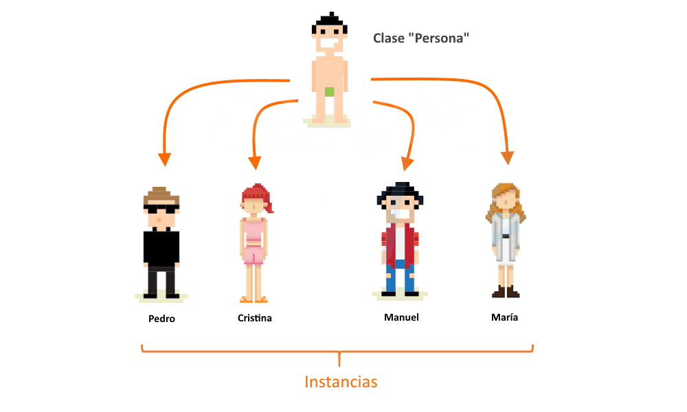
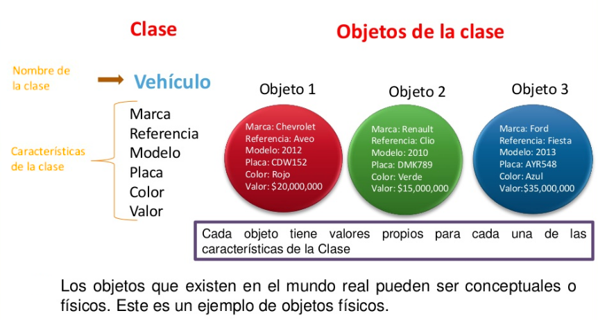

<!---
Ejemplos de inserción de videos

<video class="stretch" controls><source src="http://clips.vorwaerts-gmbh.de/big_buck_bunny.mp4" type="video/mp4"></video>
<iframe width="560" height="315" src="https://www.youtube.com/embed/3RBq-WlL4cU" frameborder="0" allowfullscreen></iframe>

slide: data-background="#ff0000" 
element: class="fragment" data-fragment-index="1"
-->

## HLC - PHP
---

<p><small> IES Luis Vélez de Guevara - Écija - Spain </small></p>


## Programación orientada a objetos

[](http://creativecommons.org/licenses/by-sa/4.0/)


## Índice
--- 
- ### Introducción
- ### POO: Clases y objetos
- ### Encapsulación
- ### Propiedades y métodos
- ### Herencia

<!--- Note: Nota a pie de página. -->


## Introducción


### En esta Unidad aprenderemos a

- Distinguir el concepto de clase y el concepto de objeto. 
- Crear clases.
- Instanciar objetos a partir de la clase creada.
- El concepto de encapsulación y los distintos tipos de modificadores de acceso.
- Trabajar con propiedades y métodos.
- El concepto de herencia.


## POO: Clases y objetos

**Programación Orientada a Objetos**


### Conceptos

- La POO es un paradigma de programación.
- En POO organizamos los datos y el código en unidades llamadas **clases**.
- La POO pretende utilizar abstracciones más próximas a la forma de pensar del ser humano. 


### Clases y objetos

- Una **clase** es una *plantilla* que representa una categoría de la realidad.
- Los **objetos** son instancias de alguna clase, es decir, concreciones de una categoría.




## Encapsulación


### Conceptos

- Mediante la **encapsulación** hacemos que todos los datos y funciones relacionadas se guarden en un único lugar. Dicho lugar es la **clase** y sus instanncias: los **objetos**.
- **Los datos almacenan el estado, y las funciones proporcionan el comportamiento**.
- Se oculta el estado, es decir, los datos solo son accesibles mediante las funciones definidas.
- El aislamiento protege a los datos contra su modificación involuntaria.


### Estado y comportamiento (I)

- Cada objeto guarda su propio estado, asignando valores a sus propiedades.




### Estado y comportamiento (II)

**Estructura de una clase en PHP**

```php
class Clase {
  /* PROPIEDADES o ATRIBUTOS. 
     Guardan el estado de cada objeto.
     Se implementan mediante variables.
  */
  
  /* MÉTODOS
     Proporcionan el comportamiento de cada objeto
     Se implementan mediante funciones.
  */   
}
```


### Modificadores de acceso

- TIPOS:
  - **public**: se puede acceder a la propiedad o al método desde cualquier lugar. Si no se indica nada, este es la situación por defecto.
  - **protected**: se puede acceder a la propiedad o método dentro de la clase y mediante clases derivadas de esa clase
  - **private**: SOLO se puede acceder a la propiedad o al método dentro de la clase

- USO HABITUAL:
  - **Las propiedades suelen tener acceso privado**
  - **Los métodos suelen tener acceso público**


## Propiedades y métodos


### Definición de clase (Ejemplo)

```php
// Archivo Persona.php
class Persona {
  // Propiedades (define el estado)
  private $nombre = null;
  private $edad   = null;
   
  // Métodos (define el comportamiento) 
  public function __construct ($nombre, $edad) {
    $this->nombre = $nombre;
  }

  public function __toString () {
    return "\nNombre: $this->nombre, Edad: $this->edad \n";
  }

  public function saluda (){
    echo "Hola, me llamo $this->nombre\n";
  }
}
```


### Métodos especiales

- **Constructor**: Inicializa el objeto.
- **Destructor**: Libera recursos del objeto.

```php
  public function __construct ($nombre, $edad) {
    $this->nombre = $nombre;
    $this->edad   = $edad;
  }

  public function __destruct () {
    echo "\nObjeto ($this->nombre, $this->edad) eliminado\n" ;
  }

  public function __toString () {
    return "\nNombre: $this->nombre, Edad: $this->edad \n";
  }
```


### Métodos getter y setter

- Métodos **getter**: devuelven el valor de una propiedad
- Métodos **setter**: dan valor a una propiedad

```php
  public function setNombre ($nombre) {
    $this->nombre = $nombre;
  }

  public function setEdad ($edad) {
    $this->edad = $edad;
  }

  public function getNombre () {
    return $this->nombre;
  }

  public function getEdad () {
    return $this->edad;
  }
```


### Otros métodos

- Cualquier otro método que nosotros definamos para proporcionar comportamiento a la clase.
- Ejemplos:

```php
  public function saluda (){
    echo "Hola, me llamo $this->nombre\n";
  }

  public function camina (){
    echo "Estoy caminando ...\n";
  }
```


### Namespaces

- Para **organizar el código** usamos `namespaces`.
- Un `namespace` es algo semejante a un paquete en Java.
- Ejemplo:

```php
<?php
namespace Colegio\Gestion;

class Persona {
  // ...
}
?>
```


### Usando nuestra clase

- En proyectos con muchos archivos usamos `include_once` para no incluir un mismo archivo múltiples veces.
- Hacemos uso de sentencia `use ...` para usar la clase deseada.
- Ejemplo:

```php
<?php
// Archivo colegio.php
include_once "Persona.php";

use Colegio\Gestion\Persona;

$pepe = new Persona ("José Antonio", 40);
?>
```


### Instanciación de objetos

- Un objeto se instancia con el operador `new` ...
- ... y el constructor de la clase con los parámetros definidos.
- El constructor inicializa el objeto: establece un estado inicial.
- Ejemplos:

```php
$pepe = new Persona ("José Antonio", 40);
$ana  = new Persona ("Ana María", 20);
$juan = new Persona ("Juan Carlos", 30);
```


## Herencia


### Conceptos

- La herencia nos permite la **reutilización de clases**.
- Podemos crear clases derivadas a partir de una **clase base**, también llamada **superclase**.
- Las clases derivadas se denominan **clases hija**. Estas clases *extienden* la funcionalidad de la clase base. 


### Creación de una clase hija 

- Usamos la palabra clave `extends`
- Ejemplo:

```php
<?php
// Archivo Estudiante.php
include_once "Persona.php";

use Colegio\Gestion\Persona;

class Estudiante extends Persona {
  private $curso = null;

  function __construct($nombre, $edad, $curso)
  {
    parent::__construct($nombre, $edad);
    $this->curso = $curso;
  } 
}
?>
```
