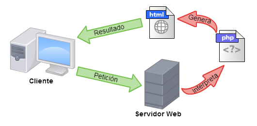

<!---
Ejemplos de inserción de videos

<video class="stretch" controls><source src="http://clips.vorwaerts-gmbh.de/big_buck_bunny.mp4" type="video/mp4"></video>
<iframe width="560" height="315" src="https://www.youtube.com/embed/3RBq-WlL4cU" frameborder="0" allowfullscreen></iframe>

slide: data-background="#ff0000" 
element: class="fragment" data-fragment-index="1"
-->

## HLC - PHP
---

<p><small> IES Luis Vélez de Guevara - Écija - Spain </small></p>


## Programación web

[](http://creativecommons.org/licenses/by-sa/4.0/)


## Índice (I)
--- 
- ### Introducción
- ### Protocolo HTTP
- ### Servidor web


## Índice (II)
--- 
- ### Variables superglobales
- ### Formularios
- ### Cookies
- ### Sesiones

<!--- Note: Nota a pie de página. -->


## Introducción


### En esta Unidad aprenderemos a

- Los conocimientos básicos del funcionamiento HTTP.
- Distinguir entre equipo servidor y equipo cliente.
- Instalar y configurar un servidor web.
- La estructura y etiquetas HTML más utilizadas.
- Trabajar con código HTML, fundamentalmente formularios.
- Trabajar con código PHP ejecutado en el servidor.
- Trabajar con cookies.
- Trabajar con sesiones.


## Protocolo HTTP


- Es un protocolo Cliente-Servidor.
- Es un protocolo Petición-Respuesta.
- Es un protocolo sin estado: no se guarda información de peticiones anteriores.  


### Ejecución de PHP

- El código PHP siempre se ejecuta en un **servidor web**.
- El cliente no ve el código PHP, sólo HTML.




## Servidor web

Usaremos Apache2 como servidor web.


### Instalación de servidor web

- Instalación de servidor web **Apache2 con soporte PHP**

```bash
sudo  apt  install  apache2  libapache2-mod-php
```


### Estructura de una página HTML

```html
<!DOCTYPE html>
<html lang="es">
<head>
    <meta charset="UTF-8">
    <meta name="viewport" content="width=device-width, initial-scale=1.0">
    <title>Documento HTML</title>
</head>
<body>
    <!-- Aquí va el cuerpo HTML -->
</body>
</html>
```


## Variables superglobales

- Son variables internas que están disponibles siempre en todos los ámbitos del script, incluso dentro de las funciones.
- Proporcionan información relevante en la comunicación cliente-servidor.


### Lista de variables

- **$_SERVER**: información sobre parámetros del servidor (nombre del servidor, puerto del usuario,
etc.).
- **$_GET**: datos recibidos desde un formulario por el método GET.  
- **$_POST**: datos recibidos desde un formulario por el método POST.
- **$_REQUEST**: datos recibidos desde un formulario (ya sea GET o POST).
- **$_COOKIE**: datos guardados por el servidor en el PC del usuario.
- **$_SESSION**: datos guardados para su uso a través de múltiples páginas.
- **$_FILES**: ficheros recibidos después de un envío.


## Formularios

- Los formularios HTML **permiten introducir datos** y enviarlos a un servidor web.
- **El servidor se encarga de procesar dichos datos**. Para ello puede usar **PHP**, JSP, Python u otro lenguaje de servidor.


### Ejemplo de formulario (cliente)

```html
<form action='script.php' method='post'>
    <input type='text'   name='dato'/>
    <input type='submit' name='boton' value='Enviar'/>
</form>
``` 
- El atributo **action** del elemento FORM indica la página a la que se le enviarán los datos del
formulario. En nuestro caso se tratará de un script PHP.
- El atributo **method** especifica el método usado para enviar la información. Normalmente será el método post.


### Ejemplo de acción (servidor)

```php
<?php 
  echo "El dato recibido es " . $_POST['dato'] ;
?>
```
- Este código PHP se ejecuta en el servidor web. 
- El cliente, es decir el navegador web, no ve el código PHP, sólo código HTML.


## Cookies


## Sesiones

