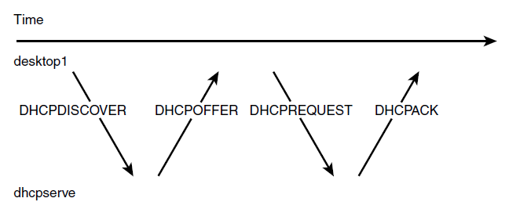

<!---
Ejemplos

<video class="stretch" controls><source src="http://clips.vorwaerts-gmbh.de/big_buck_bunny.mp4" type="video/mp4"></video>
<iframe width="560" height="315" src="https://www.youtube.com/embed/3RBq-WlL4cU" frameborder="0" allowfullscreen></iframe>

slide: data-background="#ff0000" 
element: class="fragment" data-fragment-index="1"
-->
## Servicios de Red e Internet
---

<small> IES Luis Vélez de Guevara - Écija - Spain </small>

## DHCP: Asignación dinámica de direcciones

## Índice
--- 
- ### Introducción
- ### Características
- ### Funcionamiento
- ### ISC-DHCP-Server

<!--- Note: Nota a pie de página. -->

## Introducción

**Dynamic Host Configuration Protocol**

- Protocolo de configuración dinámica de host.
- Permite a los equipos de una red obtener automáticamente una dirección IP.
- En la práctica suelen obtenerse varios parámetros:
  - Dirección IP 
  - Máscara de red
  - Puerta de enlace
  - Servidores DNS
- Simplifica la configuración de red de los equipos. 

## Características

- Es un protocolo con una arquitectura cliente/servidor.
- Es un protocolo abierto (independiente del S.O. del servidor y del cliente)
- El **servidor** escucha por el **puerto UDP 67** y el cliente por el puerto UDP 68.
- El cliente pide una IP y otros parámetros de red.
- El servidor ofrece una IP y el resto de parámetros de red.

### Desventajas de usar IP fijas

- Es necesario configurar manualmente cada PC.
- Debemos desplazarnos hasta el sitio donde está el PC para su configuración.
- Deberemos reconfigurar de nuevo cada uno de los PCs si se producen cambios en la configuración de la red.
- Inconsistencias: IP repetidas, IP no usadas, ...

### Ventajas de usar DHCP

- Permite la administración centralizada de las direcciones IP.
- Cualquier cambio en la configuración de la red se realizará desde el servidor sin necesidad de desplazarnos físicamente hasta el PC.
- Evita conflictos de direcciones repetidas.
- Los clientes podrán integrarse en la red simplemente solicitando al servidor una dirección IP.
- Reduce el desperdicio de direcciones.

## Funcionamiento 

### Protocolo cliente-servidor

- El servidor DHCP 
  - Recibe peticiones de clientes solicitando una configuración de red IP.
  - Responde proporcionando los parámentros que permitan a los clientes autoconfigurarse.
- En los clientes
  - Seleccionamos la opción 'Obtener dirección IP automáticamente'.

### Formas de asignación

Básicamente, existen 2 formas:

- **Asignación estática**: asigna una dirección IP a una máquina determinada. Se suele utilizar cuando se quiere controlar la asignación de dirección IP a cada cliente, y evitar, también, que se conecten clientes no identificados.
- **Asignación dinámica** para lo cual se definirán grupos de direcciones (pools) de los que se puedan elegir una IP para su asignación. Estos pools pueden ser compartidos entre varios servidores DHCP (configuración DHCP Failover), lo cual debe especificarse para que la sincronización entre ellos no dé problemas.

### Si no hay servidor DHCP

- **En clientes Windows**, cuando no hay servidor DHCP disponible, se utiliza la técnica APIPA.
- **APIPA** (Automatic Private IP Addressing o Direccionamiento IP Privado Automático).
- Cada cliene se autoconfigura con una dirección IP de la red 169.254.0.0/16.

### Protocolo DHCP

### Mensajes DHCP

1. **DHCPDISCOVER**. El cliente lanza una petición mediante un mensaje de difusión en busca de un servidor DHCP. Este mensaje contiene la dirección MAC y el nombre del equipo cliente para que el servidor pueda responder al cliente.
2. **DHCPOFFER**. El servidor DHCP responde a la solicitud con una oferta de dirección IP, está queda reservada para este cliente. El cliente se queda con la primera oferta recibida, dado que pueden existir varios servidores dhcp en una red, y el mensaje DHCPDISCOVER lo recibirán todos.
3. **DHCPREQUEST**. Una vez aceptada la oferta, se envía al servidor un mensaje aceptando la oferta.
4. **DHCPACK**. El servidor envía un mensaje de acuse de recibo con la dirección IP asignada y información sobre la duración de la concesión. Desde este momento el cliente tiene totalmente configurado TCP/IP.

### Terminología

- **Ámbito**. Agrupamiento administrativo de equipos o clientes de una subred que utilizan el servicio DHCP.
- **Superámbito**. Es una agrupación de ámbitos que se usan para admitir subredes IP lógicas que residen en una subred física. El Superámbito contiene ámbitos secundarios que deben configurarse manualmente.
- **Grupo o rango de direcciones**. Direcciones IP disponibles para asignar dentro de un ámbito.
- **Intervalo de exclusión**. Intervalo de direcciones IP de un ámbito que no están disponibles para conceder. Este intervalo de exclusión se reserva normalmente para asignar direcciones ip estáticas a los clientes o servidores en una red.
- **Reserva**. Asignar permanentemente una dirección IP al mismo cliente, se usa para equipos que deban conservar siempre la misma IP.
- **Concesión**. Es el periodo de tiempo en que un cliente puede usar una dirección IP, antes de que la concesión caduque el cliente envía una petición de renovación de la concesión.

### Concesiones

Cuando iniciamos un cliente DHCP, pueden darse dos situaciones:

- Que la concesión de alquiler de licencia haya caducado:
    – El cliente solicitará una nueva IP al servidor DHCP (la asignación del servidor podría o no coincidir con la anterior).
- Que la concesión de alquiler no haya caducado desde la última concesión:
    – El cliente intentará renovar su IP en el servidor DHCP, es decir, que le sea asignada la misma IP.

## ISC-DHCP-SERVER
