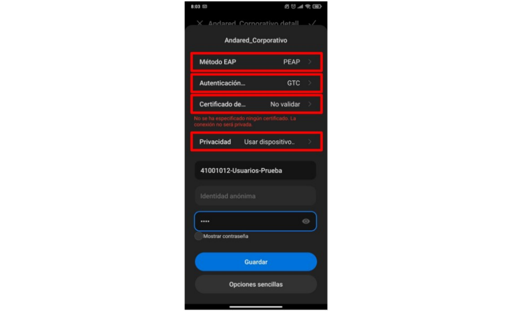

<!---
Ejemplos de inserción de videos

<video class="stretch" controls><source src="http://clips.vorwaerts-gmbh.de/big_buck_bunny.mp4" type="video/mp4"></video>
<iframe width="560" height="315" src="https://www.youtube.com/embed/3RBq-WlL4cU" frameborder="0" allowfullscreen></iframe>

slide: data-background="#ff0000" 
element: class="fragment" data-fragment-index="1"
-->

## Transformación Digital Educativa

José Antonio Muñoz Jiménez (coordinador TDE)

Antonio José Negro Lozano (coordinador CompDigEdu)

---

**www.iesluisvelez.org**

**aula.iesluisvelez.org**

---

**tic@iesluisvelez.org**

<small> IES Luis Vélez de Guevara - Écija </small>

- ### Introducción
- ### Wifi Andared_Corporativo
- ### Portal Docente - DIPA
- ### Séneca y Pasen
- ### Moodle Centros (Sevilla)
- ### Otras plataformas 

<!--- Note: Nota a pie de página. -->

## Introducción

### TRANSFORMACIÓN DIGITA EDUCATIVA

- Implantada en el curso 2020-21 en toda Andalucía.
- Sustituye a Centros TIC y Escuela 2.0. 
- **Pretende facilitar la adquisición y desarrollo de competencias digitales.** 
- A partir del curso 2022-23 se crea también la figura del Coordinador CompDigEdu.

### COMPETENCIA DIGITAL

- **Del centro educativo** (DigCompOrg)
- **Del profesorado** (DigCompEdu)
- **Del alumnado** (DigComp)

### COMPETENCIA DIGITAL DEL CENTRO

- Recogida en el **Plan de Actuación Digital** (PAD)
- **3 líneas de actuación** 
  - ORGANIZACION DEL CENTRO
  - INFORMACIÓN Y COMUNICACIÓN
  - PROCESOS DE ENSEÑANZA APRENDIZAJE

### ORGANIZACIÓN DEL CENTRO

Fomentar el uso del **Aula Virtual** para el profesorado/alumnado del centro con **Moodle Centros**.

### INFORMACIÓN Y COMUNICACIÓN

Promover el uso de los **canales oficiales de comunicación**. 
Los canales oficiales son **Séneca**, **Pasen** y **Web oficial**. 

### PROCESOS DE ENSEÑANZA APRENDIZAJE

Incorporar plenamente el uso de las TIC al proceso de enseñanza-aprendizaje. 
Uso de portátiles (tenemos 5 carritos), proyectores, ... 

### Identificador Educativo Andaluz (I)

- Las credenciales **IdEA** (Identificador Educativo Andaluz) de cualquier miembro de la comunidad educativa de Andalucía están formadas por nombre de usuario y clave/contraseña.
- Ejemplo de usuario IdEA: ***mlopgar789*** 
  - **M**aría Isabel **Lóp**ez **Gar**cía. DNI: 12456**789**

### Identificador Educativo Andaluz (II)

Se usa en 

- **Andared_Corporativo**
- **Portal Docente**
- **Séneca**
- **Pasen**
- **Moodle Centros**
- **GSuite**
- **Office 365**

## Wifi Andared_Corporativo

### Andared_Corporativo (I)

- **A final de Septiembre de 2022 se da de baja la wifi Andared**
- Se sustituye por la wifi **Andared_Corporativo**
- Es obligatoria la autenticación con credendiales IdEA
- El alumnado podrá usar 1 dispositivo como máximo
- **El profesorado podrá usar 3 dispositivos como máximo**.

### Andared_Corporativo (II)

- Guía de conexión disponible en Sala del Profesorado en Plataforma Moodle Centros.

## Portal Docente - DIPA

### Portal Docente

- Permite consultar la nómina.
- Permite consultar los nombramientos.
- Permite consultar los trienios y sexenios.
- Permite realizar numerosos trámites administrativos. 

### DIPA

- Documento que permite firmar digitalmente en Séneca. 

## Séneca y Pasen

### Séneca

- Introducir el horario
- Faltas de asistencia del alumnado
- Evaluaciones 
- Mensajes
- Versión para móvil: **iSéneca**,

### iSéneca

**Versión para móvil**

### Pasen

- Información del alumno/a para las familias.
- Versión para móvil:  **iPasen**

### iPasen

**Versión para móvil**

## Moodle Vélez

<small>https://aula.iesluisvelez.org/</small>

Asuntos **administrativos**.

Cursos de Claustro, Tutorías, ...

Plataforma a extinguir.

## Moodle Centros (Sevilla)

<small>https://educacionadistancia.juntadeandalucia.es/centros/sevilla/</small>

Asuntos **académicos**.

Cursos de ESO, Bachillerato y FP (incluida FCT).

### Características

- **Aula Virtual** muy potente y completa.
- Disponible para todos los centros de Andalucía.
- Se recomienda hacer uso de ella para el proceso E/A.
- Se puede hacer copia de seguridad de los cursos creados (**aulas**)  
- Se puede restaurar dicha copia en cualquier plataforma Moodle.

### Contenido del curso (aula)

- **Recursos**
  - Etiquetas
  - Archivos (es posible arrastrar y soltar)
- **Actividades**
  - Tareas
  - Cuestionarios (exámenes)

***NOTA: Existen muchos más tipos de recursos y actividades. Se muestran aquí sólo los que tienen un uso más frecuente.***

## Otras plataformas 

### GSuite y Office365

- La Junta de Andalucia ha realizado acuerdos con 
  - Google (plataforma GSuite). **google.com**
  - Microsoft (plataforma Office 365). **office.com**
- Estos acuerdos se renuevan cada cierto tiempo.
- Existe riesgo de discontinuación, si no se renuevan los acuerdos.
- El profesorado puede gestionar su cuenta en Séneca -> Utilidades -> Cuentas corporativas.

### GSuite (google.com)

- Credenciales:
  - *usuario_IdDA* **@g.educaand.es**
  - *contraseña_IdEA*

**Aplicaciones más interesantes**

- Cuenta de correo
- Suite ofimática online
- Drive (almacenamiento en la nube)
- Meet (videoconferencias)

### Office 365 (office.com)

- Credenciales:
  - *usuario_IdDA* **@m.educaand.es**
  - *contraseña_IdEA*

**Aplicaciones más interesantes**

- Cuenta de correo
- Suite ofimática online
- OneDrive (almacenamiento en la nube)
- Teams (videoconferencias)

## FIN

**¡¡ Muchas gracias por vuestra atención !!**

