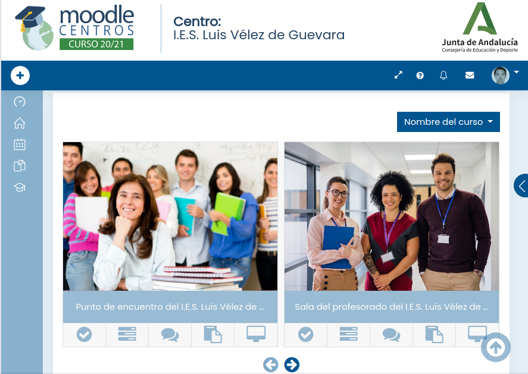
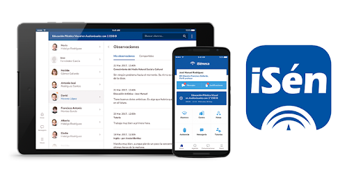
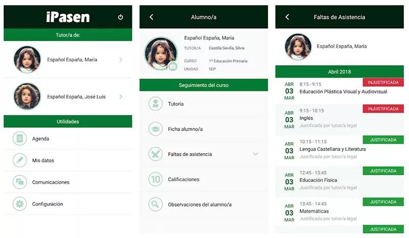
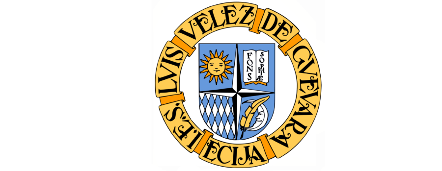

<!---
Ejemplos de inserción de videos

<video class="stretch" controls><source src="http://clips.vorwaerts-gmbh.de/big_buck_bunny.mp4" type="video/mp4"></video>
<iframe width="560" height="315" src="https://www.youtube.com/embed/3RBq-WlL4cU" frameborder="0" allowfullscreen></iframe>

slide: data-background="#ff0000" 
element: class="fragment" data-fragment-index="1"
-->

## Transformación Digital Educativa

**www.iesluisvelez.org**

**tic@iesluisvelez.org**

---

José Antonio Muñoz Jiménez (coordinador TDE)

<small> IES Luis Vélez de Guevara - Écija </small>

- ### Introducción
- ### Portal Docente - DIPA
- ### Moodle Centros (Sevilla)
- ### Séneca y Pasen
- ### Google Drive 

<!--- Note: Nota a pie de página. -->

## Introducción

### TRANSFORMACIÓN DIGITA EDUCATIVA

- Implantada en el curso 2020/21 en toda Andalucía.
- Sustituye a Centros TIC y Escuela 2.0. 
- Pretende facilitar la adquisición y desarrollo de competencias digitales. 

### COMPETENCIA DIGITAL

- **Del centro educativo** (DigCompOrg)
- **Del profesorado** (DigCompEdu)
- **Del alumnado** (DigComp)

### COMPETENCIA DIGITAL DEL CENTRO

- Recogida en el **Plan de Actuación Digital** (PAD)
- **3 líneas de actuación** 
  - ORGANIZACION DEL CENTRO
  - INFORMACIÓN Y COMUNICACIÓN
  - PROCESOS DE ENSEÑANZA APRENDIZAJE

### ORGANIZACIÓN DEL CENTRO

Establecer **Aula Virtual** para el profesorado/alumnado del centro con **Moodle Centros**.

### INFORMACIÓN Y COMUNICACIÓN

Promover el uso de los **canales oficiales de comunicación**. Los canales oficiales son Séneca, Pasen y web oficial tanto de PC como en aplicación móvil. 

### PROCESOS DE ENSEÑANZA APRENDIZAJE

Incorporar plenamente el uso de las TIC al proceso de enseñanza-aprendizaje. Uso de portátiles, proyectores, ... 

BYOD (Bring Your Own Device)

### Identificador Educativo Andaluz (I)

- Las credenciales **IdEA** (Identificador Educativo Andaluz) de cualquier miembro de la comunidad educativa de Andalucía están formadas por nombre de usuario y clave/contraseña.
- Ejemplo de usuario IdEA: ***mlopgar789*** 
  - **M**aría Isabel **Lóp**ez **Gar**cía. DNI: 12456**789**

### Identificador Educativo Andaluz (II)

- **Se usa en Portal Docente, Séneca, Pasen ...**
- Solicitar activación al Equipo Directivo.

## Portal Docente - DIPA

### Portal Docente

- Permite consultar la nómina.
- Permite consultar los nombramientos.
- Permite consultar los trienios y sexenios.
- Permite realizar numerosos trámites administrativos. 

### DIPA

- Documento que permite firmar digitalmente en Séneca. 

## Moodle Centros (Sevilla)

### Características

- **Aula Virtual** muy potente y completa.
- Disponible para todos los centros de Andalucía.
- Se recomienda hacer uso de ella para el proceso E/A.
- Se puede hacer copia de seguridad de los cursos creados (**aulas**)  
- Se puede restaurar dicha copia en cualquier plataforma Moodle.

## Séneca y Pasen

### Séneca

- Faltas de asistencia del alumnado
- Evaluaciones 
- Mensajes
- Versión para móvil: **iSéneca**,

### iSéneca

**Versión para móvil**

### Pasen

- Información del alumno/a para las familias.
- Versión para móvil:  **iPasen**

### iPasen

**Versión para móvil**

## Google Drive 

### Características

- Alojamiento de cualquier tipo de archivo en la nube.
- Unos 15GB de almacenamiento.
- Si tienes cuenta de GMail, sólo hay que activarlo.
- También sirve como suite ofimática on-line.
- Su uso es muy recomendable.

## FIN

**¡¡ Muchas gracias por vuestra atención !!**

***¿Alguna pregunta?***

